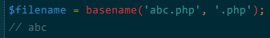
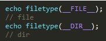
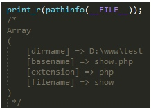

# 文件系统相关扩展 - Filesystem

这个扩展不需要其他库, 但是如果你希望php支持大文件, 需呀 glibc.


无需安装

## 配置


`allow_url_fopen` 默认 : "1"

PHP_INI_SYSTEM     允许URL访问文件

`allow_url_include`  默认 : "0"
允许远程包含文件

`user_agent`  默认 : Null

PHP_INI_ALL        定义 PHP 发送的 User-Agent

`default_socket_timeout` 默认 : 60

PHP_INI_ALL        

`from` 默认 : ""
PHP_INI_ALL        定义匿名ftp的密码

`auto_detect_line_endings` 默认 : "0"

PHP_INI_ALL        当设置为ON是,php将检测行的结束符符合那种操作系统


## 函数

`string basename ( string $path [, string $suffix ] )`

返回路径中的文件名部分
- $suffix     需要去除的后缀名




`bool chgrp ( string $filename , mixed $group )`

改变文件所属的组
- $group    组名或者id

`bool chmod ( string $filename , int $mode )`

改变文件模式
     给定的模式必须以八进制给出,十进制的数字或者字串系统可能不会识别

`bool chown ( string $filename , mixed $user )`

改变文件的所有者
- $user     用户user或者id

`void clearstatcache ([ bool $clear_realpath_cache = false [, string $filename ]] )`

清除文件状态缓存
     如果脚本在执行期间有被删除或者是修改的危险时, 需要清除文件缓存
    当使用以下函数的时候,php会储存相关状态以提供更高的性能,本函数会清空这些缓存的状态
    stat()， lstat()， file_exists()， 
    is_writable()， is_readable()， is_executable()， is_file()， is_dir()， is_link()， 
    filectime()， fileatime()， filemtime()， 
    fileinode()， filegroup()， fileowner()， filesize()， filetype()和 fileperms()

`bool copy ( string $source , string $dest )`

复制文件从source到$dest

`string dirname ( string $path )`

返回路径中的目录部分, 没有后缀斜线

`float disk_free_space ( string $directory )`

[alias] diskfreespace()
    返回目录中的可用空间
    给出一个包含有一个目录的字符串，本函数将根据相应的文件系统或磁盘分区返回可用的字节数

`float disk_total_space ( string $directory )`

返回一个目录的磁盘的总大小
     给出一个包含有一个目录的字符串，本函数将根据相应的文件系统或磁盘分区返回所有的字节数

`bool fclose ( resource $handle )`

关闭一个已经打开的文件指针

`bool feof ( resource $handle )`

检测是否到了文件末尾

`bool fflush ( resource $handle )`

本函数强制将所有缓冲的输出写入 handle 文件句柄所指向的资源。 成功时返回 TRUE， 或者在失败时返回 FALSE.

`string fgetc ( resource $handle )`

从文件指针中读取一个字符,碰到eof则返回false

`array fgetcsv ( int $handle [, int $length [, string $delimiter [, string $enclosure ]]] )`

从文件中读取一行并一句csv格式解析读取的行, 这里返回的是一个数组

`string fgets ( int $handle [, int $length ] )`

从文件指针中读取一行

`string fgetss ( resource $handle [, int $length [, string $allowable_tags ]] )`

从文件指针中读取一行并且过滤掉html标记和PHP标记

`bool file_exists ( string $filename )`

检测文件或者目录是否存在

`string file_get_contents ( string $filename [, bool $use_include_path [, resource $context [, int $offset [, int $maxlen ]]]] )`

将整个文件杜宇一个字串,这是将文件的内容读入到一个字符串的首选方法.

`int file_put_contents ( string $filename , string $data [, int $flags [, resource $context ]] )`

将一个字串写入文件, 这里和一次调用fopen, fwrite, fclose功能一样.

`array file ( string $filename [, int $use_include_path [, resource $context ]] )`

将整个文件读入到数组中, 每个单元都是文件中相应的一行

`int fileatime ( string $filename )`

文件访问的时间 file access time

`int filectime ( string $filename )`

文件上次inod被修改的时间,如果是数据改变所有者改变.
     这是 "最后更新时间" 

`int filemtime ( string $filename )`

取得文件修改时间.

`int filegroup ( string $filename )`

取得文件的组

`int fileinode ( string $filename )`

取得文件的inode节点号

`int fileowner ( string $filename )`

取得文件的所有者的ID

`int fileperms ( string $filename )`

取得文件的访问权限.

`int filesize ( string $filename )`

取得文件的大小

`string filetype ( string $filename )`

取得文件的类型, 可能的值有 fifo, char, dir, block, link, file, unknown




`bool flock ( int $handle , int $operation [, int &$wouldblock ] )`

轻便的咨询文件锁定
- $operation     
          LOCK_SH          共享锁定(读取)
          LOCK_EX          独占锁定(写入)
          LOCK_UN          释放锁定

`bool fnmatch ( string $pattern , string $string [, int $flags ] )`

使用 ?　* 来匹配文件名
     [5.3.0]兼容WIN

`resource fopen ( string $filename , string $mode [, bool $use_include_path [, resource $zcontext ]] )`

打开文件或者URL
     将指定的资源绑定到一个流上.
- $mode
  r      只读, 指向文件头
  r+     读写, 指向文件头
  w      写入方式打开, 截取为0, 文件头, 不存在,创建之
  w+     读写, 文件头,截取0, 不存在,创建之
  a      写入,指向末尾,不存在,创建之
  a+     读写, 文件末尾,不存在创建之
  x      创建并以写入方式打开,文件指向文件头, 存在则报错
  x+     创建,读写方式打开,文件指向文件头,存在则报错

`int fpassthru ( resource $handle )`

输出文件指针处的所有剩余数据

`int fputcsv ( resource $handle [, array $fields [, string $delimiter [, string $enclosure ]]] )`

格式转化为csv并且写入文件指针

`string fread ( int $handle , int $length )`

读取指定长度的字串.二进制文件,参数上加上 b, 对于 fopen来说

`mixed fscanf ( resource $handle , string $format [, mixed &$... ] )`

从fopen打开的句柄中根据提供的格式来分析变量
- $format说明

```
 %     起始符
 [-+]  -- 可选的数字符号标识符   
           %-d      输出数值的复数
           %+d      数值原样输出数值
 [']   -- 可选的填充标示符,用于字串
           %'#10s   使用自定义的#号来右对齐填充字串
 [-]   -- 对齐标示符,默认右对齐,-表示左对齐
           %-10s    左对齐填充字串
 [\d+] -- 宽度标示符
           %10s     输出10个字符的宽度
 [.]   -- 小数点标示符,显示浮点数的后几位 
           %.5f     五位小数的浮点数
 [$]   -- 位置标识符, 变量标示符  
           1$       表示第一个变量
      %     百分号
      b     变量为认为是整数,以二进制位显示这个整数
      c     返回字符的ASCII字符值
      d     十进制位的数值表现形式
      e     参数被以科学计数法显示
      E     大写的科学计数法显示
      u     整数形式,但是是无符号的数值
      f     浮点数形式
      F     浮点数形式(non-locale aware)
      g     %e和%f的简写
      G     %E和%f的简写
      o     数值的八进制表示形式
      s     字串表示形式
      x     十六进制的小写形式
      X     十六进制的大写形式
```

`int fseek ( resource $handle , int $offset [, int $whence ] )`

文件指针定位

`array fstat ( resource $handle )`

通过已经打开的指针取得文件信息

`int ftell ( resource $handle )`

返回文件指针读/写的位置

`bool ftruncate ( resource $handle , int $size )`

将问价截断到给定的长度.

`int fwrite ( resource $handle , string $string [, int $length ] )`

将字串写入句柄

`array glob ( string $pattern [, int $flags ] )`

寻找与模式匹配的文件路径

`bool is_dir ( string $filename )`

判断给定的文件名是否是一个目录

`bool is_executable ( string $filename )`

判断给定的文件是否可执行

`bool is_file ( string $filename )`

判断给定的文件名是否为一个正常的文件

`bool is_link ( string $filename )`

检测文件名是否为一个符号连接

`bool is_readable ( string $filename )`

判断给定的文件是否可读

`bool is_uploaded_file ( string $filename )`

检测文件是否是通过http post 上传的.

`bool is_writable ( string $filename )`

判断文件是否可写

`bool lchgrp ( string $filename , mixed $group )`

更改快捷方式的所有组

`bool lchown ( string $filename , mixed $user )`

更改快捷方式的所有者

`bool link ( string $target , string $link )`

[win][php5.3]建立快捷方式(硬链接)

`int linkinfo ( string $path )`

获取连接的信息

`array lstat ( string $filename )`

获取一个符号连接或者文件连接的信息

`bool mkdir ( string $pathname [, int $mode [, bool $recursive [, resource $context ]]] )`

建立文件夹,支持递归建立
- $recursive
          递归建立文件夹

`bool move_uploaded_file ( string $filename , string $destination )`

将上传的文件移动到新位置, 如果存在则覆盖

`array parse_ini_file ( string $filename [, bool $process_sections ] )`

分析一个ini配置文件
- $proces_sections
          将进程组分析为关联数组

`array parse_ini_string ( string $ini [, bool $process_sections = false [, int $scanner_mode = INI_SCANNER_NORMAL ]] )`

[5.3] 分析一个配置字串, 以关联数组形式返回配置字串

`mixed pathinfo ( string $path [, int $options ] )`

返回文件路径的信息
- $options
      PATHINFO_DIRNAME   文件目录
      PATHINFO_BASENAME  基础名称
      PATHINFO_EXTENSION 扩展




`int pclose ( resource $handle )`

关闭进程指针

`resource popen ( string $command , string $mode )`

打开进程

`int readfile ( string $filename [, bool $use_include_path [, resource $context ]] )`

读入一个文件并写入到缓冲

`string readlink ( string $path )`

返回符号连接指向的目标

`array realpath_cache_get ( void )`

获取真实路径缓存信息

`int realpath_cache_size ( void )`

真实路径缓存大小

`string realpath ( string $path )`

返回规范化的据对路径名

`bool rename ( string $oldname , string $newname [, resource $context ] )`

尝试把oldname重命名为 newname

`bool rewind ( resource $handle )`

回退到文件指针的位置

`bool rmdir ( string $dirname )`

删除空目录

`array stat ( string $filename )`

获取指定文件的信息

`bool symlink ( string $target , string $link )`

建立一个符号连接.

`string tempnam ( string $dir , string $prefix )`

建立一个具有唯一文件名的文件.

`resource tmpfile ( void )`

建立一个临时文件

`bool touch ( string $filename [, int $time [, int $atime ]] )`

设定文件的访问和修改时间.

`int umask ([ int $mask ] )`

改变当前的umask

`bool unlink ( string $filename )`

删除文件
     [delete()] 这个函数不存在, 只是为了存在一个入口

