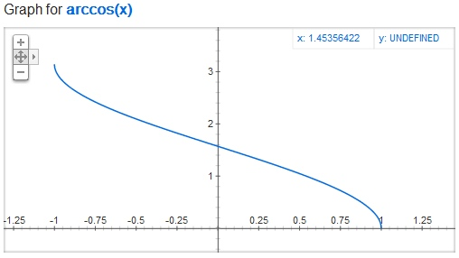
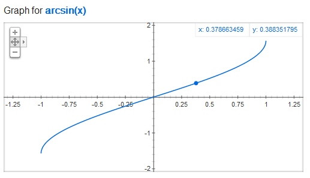
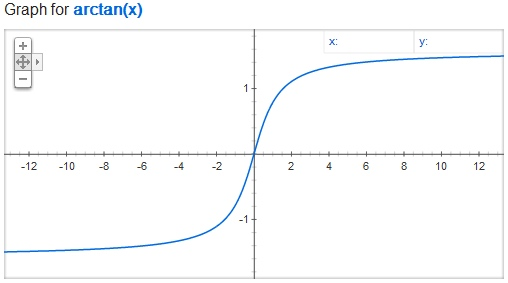
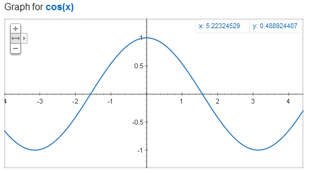
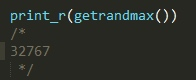

# 数学扩展 - Math 数学函数

这些数学函数基于本机所能处理的最大范围来处理数据, 如果你需要更大范围的处理函数, 参考  数学扩展 - BCMath

## 预定义常量

| 常量  | 值  | 说明  |
|---|---|---|
| M_PI | 3.14159265358979323846        | Pi |
| M_E | 2.7182818284590452354 | e |
| M_LOG2E | 1.4426950408889634074 | log_2 e |
| M_LOG10E | 0.43429448190325182765 | log_10 e |
| M_LN2 | 0.69314718055994530942 | log_e 2 |
| M_LN10 | 2.30258509299404568402 | log_e 10 |
| M_PI_2 | 1.57079632679489661923 | pi/2 |
| M_PI_4 | 0.78539816339744830962 | pi/4 |
| M_1_PI | 0.31830988618379067154 | 1/pi |
| M_2_PI | 0.63661977236758134308 | 2/pi |
| M_SQRTPI | 1.77245385090551602729 | sqrt(pi) [5.2.0] |
| M_2_SQRTPI        | 1.12837916709551257390 | 2/sqrt(pi) |
| M_SQRT2 | 1.41421356237309504880 | sqrt(2) |
| M_SQRT3 | 1.73205080756887729352 | sqrt(3) [5.2.0] |
| M_SQRT1_2 | 0.70710678118654752440 | 1/sqrt(2) |
| M_LNPI | 1.14472988584940017414 | log_e(pi) [5.2.0] |
| M_EULER | 0.57721566490153286061 | Euler constant [5.2.0] |

用 [5.2.0] 标记的常量是在 PHP 5.2.0 中增加的

## 函数

`number abs ( mixed $number )`

返回参数 number 的绝对值。 

`float acos ( float $arg )`

返回 arg 的反余弦值，单位是弧度。 acos() 是 cos() 的反函数，它的意思是在 acos() 范围里的每个值都是 a==cos(acos(a)) 。 

     
`float acosh ( float $arg )`

[5.3.0] 已经在所有平台实现, 5.2 未在win平台下实现 
     返回 arg 的反双曲余弦值，即，其双曲余弦为 arg 的那个值。 

`float asin ( float $arg )`

返回 arg 的反正弦值，单位是弧度。 asin() 是 sin() 的反函数，它的意思是在 asin() 范围里的每个值都是 a==sin(asin(a)) 。 

`float asinh ( float $arg )`

[5.3.0] 此函数在所有平台上可用, 5.2 未在win平台下实现 
     返回 arg 的反双曲正弦值，即，其双曲正弦为 arg 的那个值。 

`float atan2 ( float $y , float $x )`

本函数计算两个变量 x 和 y 的反正切值。和计算 y / x 的反正切相似，只除了两个参数的符号是用来确定结果的象限之外。 本函数的结果为弧度，其值在 -PI 和 PI 之间（包括 -PI 和 PI）。

`float atan ( float $arg )`

返回 arg 的反正切值，单位是弧度。 atan() 是 tan() 的反函数，它的意思是在 atan() 范围里的每个值都是 a==tan(atan(a))。 

`float atanh ( float $arg )`

[5.3.0] 此函数在所有平台上可用, 5.2 未在win平台下实现 
      返回 arg 的反双曲正切值，即，其双曲正切为 arg 的那个值。

`string base_convert ( string $number , int $frombase , int $tobase )`

在任意进制间对数字进行转换
     返回一字符串，包含 number 以 tobase 进制的表示。number 本身的进制由 frombase 指定。frombase 和 tobase 都只能在 2 和 36 之间（包括 2 和 36）。高于十进制的数字用字母 a-z 表示，例如 a 表示 10，b 表示 11 以及 z 表示 35。

`number bindec ( string $binary_string )`

bindec() 将一个二进制数转换成 integer，或者出于大小的需要，转换为 float 类型。

`float ceil ( float $value )`

返回不小于 value 的下一个整数，value 如果有小数部分则进一位。

`float cos ( float $arg )`

cos() 返回参数 arg 的余弦值。参数 arg 的单位为弧度。

`float cosh ( float $arg )`

返回 arg 的双曲余弦值，定义为 (exp(arg) + exp(-arg))/2。

`string decbin ( int $number )`

返回一字符串，包含有给定 number 参数的二进制表示。所能转换的最大数值为十进制的 4294967295，其结果为 32 个 1 的字符串。

`string dechex ( int $number )`

返回一字符串，包含有给定 number 参数的十六进制表示。
     所能转换的最大数值为十进制的 PHP_INT_MAX * 2 + 1 (或 -1)：在 32 位平台上是十进制的 4294967295，其 dechex() 的结果为 ffffffff。

`string decoct ( int $number )`

返回一字符串，包含有给定 number 参数的八进制表示。所能转换的最大数值为十进制的 4294967295，其结果为 "37777777777"。

`float deg2rad ( float $number )`

本函数把 number 从角度转换成弧度。

`float exp ( float $arg )`

返回 e 的 arg 次方值。

`float expm1 ( float $arg )`

返回 exp(number) - 1，甚至当 number 的值接近零也能计算出准确结果

`float floor ( float $value )`

返回不大于 value 的最接近的整数，舍去小数部分取整

`float fmod ( float $x , float $y )`

返回被除数（x）除以除数（y）所得的浮点数余数。

`int getrandmax ( void )`

显示随机数最大的可能值

`number hexdec ( string $hex_string )`

返回与 hex_string 参数所表示的十六进制数等值的的十进制数。 hexdec() 将一个十六进制字符串转换为十进制数。

`float hypot ( float $x , float $y )`

hypot() 函数将会跟据直角三角形的两直解边长度 x 和 y 计算其斜边的长度。或者是从标点 (x, y) 到原点的距离。该函数的算法等同于 sqrt(x*x + y*y)。

`bool is_finite ( float $val )`

检查 val 是否是是本机平台上浮点数所允许范围中的一个合法的有限值。

`bool is_infinite ( float $val )`

如果 val 为无穷大（正的或负的），例如 log(0) 的结果或者任何超出本平台的浮点数范围的值，则返回 TRUE。

`bool is_nan ( float $val )`

如果 val 为“非数值”，例如 acos(1.01) 的结果，则返回 TRUE。

`float lcg_value ( void )`

lcg_value() 返回范围为 (0, 1) 的一个伪随机数。本函数组合了周期为 2^31 - 85 和 2^31 - 249 的两个同余发生器。本函数的周期等于这两个素数的乘积。

`float log10 ( float $arg )`

返回参数 arg 以 10 为底的对数。

`float log1p ( float $number )`

log1p() 返回 log(1 + number)，甚至当 number 的值接近零也能计算出准确结果。

`float log ( float $arg [, float $base = M_E ] )`

如果指定了可选的参数 base， log() 返回 logbase arg，否则 log() 返回参数 arg 的自然对数。

`mixed max ( array $values )`

`mixed max ( mixed $value1 , mixed $value2 [, mixed $... ] )`

如果仅有一个参数且为数组， max() 返回该数组中最大的值。如果第一个参数是整数、字符串或浮点数，则至少需要两个参数而 max() 会返回这些值中最大的一个。可以比较无限多个值。

`mixed min ( array $values )`

`mixed min ( mixed $value1 , mixed $value2 [, mixed $... ] )`

如果仅有一个参数且为数组， min() 返回该数组中最小的值。如果给出了两个或更多参数, min() 会返回这些值中最小的一个。

`int mt_getrandmax ( void )`

返回调用 mt_rand() 所能返回的最大的随机数。
     获取最大的值"2147483647"

`int mt_rand ( void )`

`int mt_rand ( int $min , int $max )`

如果没有提供可选参数 min 和 max， mt_rand() 返回 0 到 mt_getrandmax() 之间的伪随机数。例如想要 5 到 15（包括 5 和 15）之间的随机数，用 mt_rand(5, 15)。

`void mt_srand ([ int $seed ] )`

用 seed 来给随机数发生器播种。 没有设定 seed 参数时，会被设为随时数。

`void srand ([ int $seed ] )`

用 seed 播下随机数发生器种子。seed 参数没有给出时，会被设为随时数
     自 PHP 4.2.0 起，不再需要用 srand() 或 mt_srand() 给随机数发生器播种 ，因为现在是由系统自动完成的。

`number octdec ( string $octal_string )`

返回 octal_string 参数所表示的八进制数的十进制等值。

`float pi ( void )`

返回圆周率的近似值。返回值的 float 精度是由 php.ini 中的 precision 指令确定。默认值是 14。你也可以使用 M_PI 常量，该常量产生与 pi() 完全相同的结果

`number pow ( number $base , number $exp )`

返回 base 的 exp 次方的幂。如果可能，本函数会返回 integer。

`float rad2deg ( float $number )`

本函数将 number 从弧度转换为角度

`int rand ( void )`

`int rand ( int $min , int $max )`

如果没有提供可选参数 min 和 max， rand() 返回 0 到 getrandmax() 之间的伪随机整数。例如想要 5 到 15（包括 5 和 15）之间的随机数，用 rand(5, 15)。

`float round ( float $val [, int $precision = 0 [, int $mode = PHP_ROUND_HALF_UP ]] )`

返回将 val 根据指定精度 precision（十进制小数点后数字的数目）进行四舍五入的结果。precision 也可以是负数或零（默认值）。

`float sin ( float $arg )`

sin() 返回参数 arg 的正弦值。参数 arg 的单位为弧度

`float sinh ( float $arg )`

返回 arg 的双曲正弦值，定义为 (exp(arg) - exp(-arg))/2。

`float sqrt ( float $arg )`

返回 arg 的平方根

`float tan ( float $arg )`

tan() 返回参数 arg 的正切值。参数 arg 的单位为弧度。

`float tanh ( float $arg )`

返回 arg 的双曲正切值，定义为 sinh(arg)/cosh(arg)。

`float atanh ( float $arg )`

返回 arg 的反双曲正切值，即，其双曲正切为 arg 的那个值。

`string base_convert ( string $number , int $frombase , int $tobase )`

返回一字符串，包含 number 以 tobase 进制的表示。number 本身的进制由 frombase 指定。frombase 和 tobase 都只能在 2 和 36 之间（包括 2 和 36）。高于十进制的数字用字母 a-z 表示，例如 a 表示 10，b 表示 11 以及 z 表示 35。

`number bindec ( string $binary_string )`

bindec() 将一个二进制数转换成 integer，或者出于大小的需要，转换为 float 类型。

`float ceil ( float $value )`

返回不小于 value 的下一个整数，value 如果有小数部分则进一位。

`float cos ( float $arg )`

cos() 返回参数 arg 的余弦值。参数 arg 的单位为弧度。

`float cosh ( float $arg )`

返回 arg 的双曲余弦值，定义为 (exp(arg) + exp(-arg))/2。

`string decbin ( int $number )`

返回一字符串，包含有给定 number 参数的二进制表示。所能转换的最大数值为十进制的 4294967295，其结果为 32 个 1 的字符串。

`string dechex ( int $number )`

返回一字符串，包含有给定 number 参数的十六进制表示。
     所能转换的最大数值为十进制的 PHP_INT_MAX * 2 + 1 (或 -1)：在 32 位平台上是十进制的 4294967295，其 dechex() 的结果为 ffffffff。

`string decoct ( int $number )`

返回一字符串，包含有给定 number 参数的八进制表示。所能转换的最大数值为十进制的 4294967295，其结果为 "37777777777"。

`float deg2rad ( float $number )`

本函数把 number 从角度转换成弧度。

`float exp ( float $arg )`

返回 e 的 arg 次方值。

`float expm1 ( float $arg )`

返回 exp(number) - 1，甚至当 number 的值接近零也能计算出准确结果

`float floor ( float $value )`

返回不大于 value 的最接近的整数，舍去小数部分取整

`float fmod ( float $x , float $y )`

返回被除数（x）除以除数（y）所得的浮点数余数。

`int getrandmax ( void )`

显示随机数最大的可能值

`number hexdec ( string $hex_string )`

返回与 hex_string 参数所表示的十六进制数等值的的十进制数。 hexdec() 将一个十六进制字符串转换为十进制数。

`float hypot ( float $x , float $y )`

hypot() 函数将会跟据直角三角形的两直解边长度 x 和 y 计算其斜边的长度。或者是从标点 (x, y) 到原点的距离。该函数的算法等同于 sqrt(x*x + y*y)。

`bool is_finite ( float $val )`

检查 val 是否是是本机平台上浮点数所允许范围中的一个合法的有限值。

`bool is_infinite ( float $val )`

如果 val 为无穷大（正的或负的），例如 log(0) 的结果或者任何超出本平台的浮点数范围的值，则返回 TRUE。

`bool is_nan ( float $val )`

如果 val 为“非数值”，例如 acos(1.01) 的结果，则返回 TRUE。

`float lcg_value ( void )`

lcg_value() 返回范围为 (0, 1) 的一个伪随机数。本函数组合了周期为 2^31 - 85 和 2^31 - 249 的两个同余发生器。本函数的周期等于这两个素数的乘积。

`float log10 ( float $arg )`

返回参数 arg 以 10 为底的对数。

`float log1p ( float $number )`

log1p() 返回 log(1 + number)，甚至当 number 的值接近零也能计算出准确结果。

`float log ( float $arg [, float $base = M_E ] )`

如果指定了可选的参数 base， log() 返回 logbase arg，否则 log() 返回参数 arg 的自然对数。

`mixed max ( array $values )`

`mixed max ( mixed $value1 , mixed $value2 [, mixed $... ] )`

如果仅有一个参数且为数组， max() 返回该数组中最大的值。如果第一个参数是整数、字符串或浮点数，则至少需要两个参数而 max() 会返回这些值中最大的一个。可以比较无限多个值。

`mixed min ( array $values )`

`mixed min ( mixed $value1 , mixed $value2 [, mixed $... ] )`

如果仅有一个参数且为数组， min() 返回该数组中最小的值。如果给出了两个或更多参数, min() 会返回这些值中最小的一个。

`int mt_getrandmax ( void )`

返回调用 mt_rand() 所能返回的最大的随机数。

`int mt_rand ( void )`

`int mt_rand ( int $min , int $max )`

如果没有提供可选参数 min 和 max， mt_rand() 返回 0 到 mt_getrandmax() 之间的伪随机数。例如想要 5 到 15（包括 5 和 15）之间的随机数，用 mt_rand(5, 15)。

`void mt_srand ([ int $seed ] )`

用 seed 来给随机数发生器播种。 没有设定 seed 参数时，会被设为随时数。
`void srand ([ int $seed ] )`

用 seed 播下随机数发生器种子。seed 参数没有给出时，会被设为随时数
     自 PHP 4.2.0 起，不再需要用 srand() 或 mt_srand() 给随机数发生器播种 ，因为现在是由系统自动完成的。

`number octdec ( string $octal_string )`

返回 octal_string 参数所表示的八进制数的十进制等值。

`float pi ( void )`

返回圆周率的近似值。返回值的 float 精度是由 php.ini 中的 precision 指令确定。默认值是 14。你也可以使用 M_PI 常量，该常量产生与 pi() 完全相同的结果

`number pow ( number $base , number $exp )`

返回 base 的 exp 次方的幂。如果可能，本函数会返回 integer。

`float rad2deg ( float $number )`

本函数将 number 从弧度转换为角度

`int rand ( void )`

`int rand ( int $min , int $max )`

如果没有提供可选参数 min 和 max， rand() 返回 0 到 getrandmax() 之间的伪随机整数。例如想要 5 到 15（包括 5 和 15）之间的随机数，用 rand(5, 15)。

`float round ( float $val [, int $precision = 0 [, int $mode = PHP_ROUND_HALF_UP ]] )`

返回将 val 根据指定精度 precision（十进制小数点后数字的数目）进行四舍五入的结果。precision 也可以是负数或零（默认值）。

`float sin ( float $arg )`

sin() 返回参数 arg 的正弦值。参数 arg 的单位为弧度

`float sinh ( float $arg )`

返回 arg 的双曲正弦值，定义为 (exp(arg) - exp(-arg))/2。

`float sqrt ( float $arg )`

返回 arg 的平方根

`float tan ( float $arg )`

tan() 返回参数 arg 的正切值。参数 arg 的单位为弧度。

`float tanh ( float $arg )`

返回 arg 的双曲正切值，定义为 sinh(arg)/cosh(arg)。

