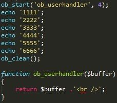
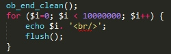
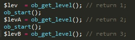
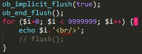
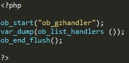

# 影响PHP行为的扩展 - 输出控制


php脚本有输出的时候, 输出控制函数可用这些来控制输出, 这在多种不清情况中非常有用, 尤其是用来在脚本开始输出数据后,发送http头信息到浏览器. 输出控制看书,不影响由header()或setcookie()发送的文件头信息, 仅仅影响 echo这样的函数和PHP代码块间的数据


## 安装


## 配置

`output_buffering     int` (默认 "0")

PHP_INI_PERDIR     如果开启,将在所有脚本中开启缓存输出, 如果控制输出缓冲区的最大值, 可以讲该选项设定为缓存的最大字节数
在PHP-CLI模式下,总是 Off 
php-cli简介——不会shell语言，一样用shell！


`output_handler       string` (默认:Null)

PHP_INI_PERDIR     可将所有的脚本输出,重定向到一个函数,这里设置的函数将自动的处理输出缓冲, 这里填写的只能是内置函数
不能同时使用 mb_output_handler() 和 ob_iconv_handler()，也不能同时使用 ob_gzhandler() 和 zlib.output_compression。 
     

`implicit_flush     boolean` (默认: 0)

PHP_INI_ALL     默认关闭,开启的时候讲自动输出信息块, 等同于使用echo()函数后使用flush()输出
不在web中编程的时候, 开启将极大影响性能, cli,sapi执行下, 默认为true;


## 函数

`bool ob_start ([ callback $output_callback [, int $chunk_size [, bool $erase ]]] )`

缓存输出开始函数,并且可以传递一个函数作为缓冲处理函数

```
 $output_callback  指定输出的函数的名称,该函数可以使用系统自带的 ob_gzhandler, 此函数把一个字符串当作参数并返回一个字符串
 $chunk_size       指定大于这个大小之后的每次输出均被指定的缓冲函数处理
 $erase            默认为 true, 调用完成后删除缓冲, 如果指定为 false, 则在脚本完成之后删除缓冲
```



     
     
`void flush ( void )`

刷新输出缓冲, 该函数将当前为止程序的所有输出发送到用户的浏览器
flush() 函数不会对服务器或客户端浏览器的缓存模式产生影响。因此，必须同时使用 ob_flush() 和flush() 函数来刷新输出缓冲
在 php 5.3.13 中, 默认是开启缓存的, 所以使用ob_get_level()会获取到1的值,同样的是, 直接使用 flush()函数不会输出也是因为会有缓冲




`void ob_clean ( void )`

清空缓冲区的内容

`bool ob_end_clean ( void )`

清空并缓冲区内容并关闭这个缓冲区

`bool ob_end_flush ( void )`

关闭缓存, 并且输出

`void ob_flush ( void )`

送出缓冲区内容

`string ob_get_clean ( void )`

获取缓冲区内容并且清除掉缓冲

`string ob_get_contents ( void )`

获取缓存区内容但是不会清除

`string ob_get_flush ( void )`

获取缓存区内容并且输出

`int ob_get_length ( void )`

获取当前缓冲区的长度
等同于 strlen(ob_get_contents())

`int ob_get_level ( void )`



返回当前缓存的级别
在 php5.3.13 中, 直接执行本函数则返回一个 1 的数值
     

`array ob_get_status ([ bool$full_status = FALSE ] )`

获取当前缓冲区的状态,如果指定为true, 则返回所有缓冲区的状态
获取到的数组

```
[level] => 1                         级别
[type] => 1                          
      PHP_OUTPUT_HANDLER_INTERNAL (0)
      PHP_OUTPUT_HANDLER_USER (1)
[status] => 0
      PHP_OUTPUT_HANDLER_START (0)
      PHP_OUTPUT_HANDLER_CONT (1)
      PHP_OUTPUT_HANDLER_END (2)
[name] => default output handler
      起作用的缓冲器的名称
[del] => 1
      ob_start()设定的清除标志
```

`string ob_gzhandler ( string $buffer , int $mode )`

使用ob_start 调用的默认的处理函数
以方便将gz 编码的数据发送到支持压缩页面的浏览器
本函数 需要 zlib 扩展

`void ob_implicit_flush ([ int $flag = true ] )`
打开绝对刷送, 在调用本函数的时候确定关闭了 PHP自带的缓冲机制,否则等待PHP的缓冲区满, 不然不会产生新的输送的.
这里不会调用 flush()函数的也会显示输出值, 和 flush() 函数介绍的有相同的含义, 




`array ob_list_handlers ( void )`


列出使用中的输出处理程序, php默认已经开启了缓存
这里返回的将是包含了 ob_gzhandler 和 default output handler 的数组.
     

`bool output_add_rewrite_var ( string $name , string $value )`
添加url重写器的值
这里的 名称 / 值 对 将被以get的方式添加到url中, 或者添加到 form 中的隐藏域中
当透明URL重写用 session.use_trans_sid 开启时同样可以添加到session ID
要注意，绝对URL(http://example.com/..)不能被重写。 
此函数的行为由 url_rewriter.tags php.ini参数控制。 


`bool output_reset_rewrite_vars ( void )`

此函数重置URL重写器，移除所有的先前由output_add_rewrite_var()函数设置的重写变量


