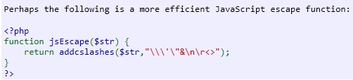
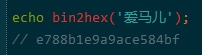
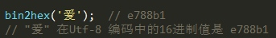
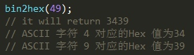
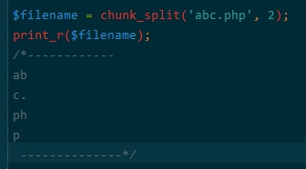
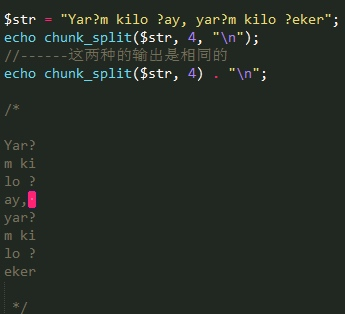
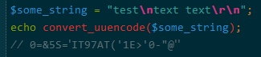
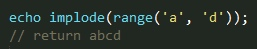

# 文本处理 - 字符串(String)


这些都是以各种方式处理字符串的函数, 还有一些专门放在正则表达式和url处理部分


## 安装

核心无需安装


## 配置

没有定义配置

预定义常量

CRYPT_SALT_LENGTH integer 
CRYPT_STD_DES integer 
CRYPT_EXT_DES integer 
CRYPT_MD5 integer 
CRYPT_BLOWFISH integer 
HTML_SPECIALCHARS (integer) 
HTML_ENTITIES (integer) 
ENT_COMPAT (integer) 
ENT_QUOTES (integer) 
ENT_NOQUOTES (integer) 
CHAR_MAX (integer) 
LC_CTYPE (integer) 
LC_NUMERIC (integer) 
LC_TIME (integer) 
LC_COLLATE (integer) 
LC_MONETARY (integer) 
LC_ALL (integer) 
LC_MESSAGES (integer) 
STR_PAD_LEFT (integer) 
STR_PAD_RIGHT (integer) 
STR_PAD_BOTH (integer) 

## 函数

`string addcslashes ( string $str , string $charlist )`

返回字符串，该字符串在属于参数 charlist 列表中的字符前都加上了反斜线
其中转义字符列表可以使用'..'来对字符进行范围的控制, 范围是根据内容在ASCII码表中的位置进行创建的
0，a，b，f，n，r，t , v  C语言的预定义序列
- $charlist 参数，如“\0..\37”，将转义所有 ASCII 码介于 0 和 31 之间的字符。 


     

`string addslashes ( string $str )`

返回字符串，该字符串为了数据库查询语句等的需要在某些字符前加上了反斜线。这些字符是单引号（'）、双引号（"）、反斜线（\）与 NUL（NULL 字符）。 
PHP 5.4 之前 PHP 指令 magic_quotes_gpc 默认是 on , 遇到这种情况时可以使用函数 get_magic_quotes_gpc() 进行检测。

`string bin2hex ( string $strord )`

返回 ASCII 字符串，为参数 str 的十六进制表示
将二进制数据转换成十六进制表示







`string chr ( int $ascii )`

返回相对应于 ascii 所指定的单个字符

`string chunk_split ( string $body [, int $chunklen = 76 [, string $end = "\r\n" ]] )`

将字符串分割成小块
[例]将 base64_encode() 的输出转换成符合 RFC 2045 语义的字符串








`string convert_cyr_string ( string $str , string $from , string $to )`

将字符由一种 Cyrillic 字符转换成另一种
支持的类型
- k - koi8-r 
- w - windows-1251 
- i - iso8859-5 
- a - x-cp866 
- d - x-cp866 
- m - x-mac-cyrillic 

`string convert_uudecode ( string $data )`

解码一个 uuencode 编码的字符串

`string convert_uuencode ( string $data )`

使用 uuencode 算法对一个字符串进行编码。 
uuencode 算法会将所有（含二进制）字符串转化为可输出的字符， 并且可以被安全的应用于网络传输。使用 uuencode 编码后的数据 将会比源数据大35%左右 




`mixed count_chars ( string $string [, int $mode = 0 ] )`

统计 string 中每个字节值（0..255）出现的次数，使用多种模式返回结果。
- $mode 
  0 - 以所有的每个字节值作为键名，出现次数作为值的数组。 
  1 - 与 0 相同，但只列出出现次数大于零的字节值。           
  2 - 与 0 相同，但只列出出现次数等于零的字节值。
  3 - 返回由所有使用了的字节值组成的字符串。 
  4 - 返回由所有未使用的字节值组成的字符串。 

`int crc32 ( string $str )`

计算一个字符串的 crc32 多项式
 这通常用于计算传输的数据是否完整
 由于 PHP 的整数是带符号的，所以在 32 位系统上许多 crc32 校验码将返回负整数。
 因此需要使用 sprintf() 或 printf() 的“%u”格式符来获取表示无符号的字符串。
 由于此函数依赖的算法已不足够复杂,不推荐使用此函数对明文密码加密

`string crypt ( string $str [, string $salt ] )`

单向字符串散列

`void echo ( string $arg1 [, string $... ] )`

输出一个或多个字符串

`array explode ( string $delimiter , string $string [, int $limit ] )`

使用一个字符串分割另一个字符串

`int fprintf ( resource $handle , string $format [, mixed $args [, mixed $... ]] )`

写入一个根据 format 格式化后的字符串到 由 handle 句柄打开的流中。 

`array get_html_translation_table ([ int $table = HTML_SPECIALCHARS [, int $flags = ENT_COMPAT | ENT_HTML401 [, string $encoding = 'UTF-8' ]]] )`

返回使用 htmlspecialchars() 和 htmlentities() 后的转换表

`string hebrev ( string $hebrew_text [, int $max_chars_per_line = 0 ] )`

将逻辑顺序希伯来文（logical-Hebrew）转换为视觉顺序希伯来文（visual-Hebrew）

`string hebrevc ( string $hebrew_text [, int $max_chars_per_line = 0 ] )`

将逻辑顺序希伯来文（logical-Hebrew）转换为视觉顺序希伯来文（visual-Hebrew），并且转换换行符, 本函数会额外将换行符(\n)转换为"\n"

`string hex2bin ( string $data )`

[5.4.0] 解码 16 进制-> 二进制字符

`string html_entity_decode ( string $string [, int $flags = ENT_COMPAT | ENT_HTML401 [, string $encoding = 'UTF-8' ]] )`

转换HTML实体->指定字符

`string htmlentities ( string $string [, int $flags = ENT_COMPAT | ENT_HTML401 [, string $encoding = 'UTF-8' [, bool $double_encode = true ]]] )`

转换HTML代码->html实体所有有实体的都会被转义

`string htmlspecialchars ( string $string [, int $flags = ENT_COMPAT | ENT_HTML401 [, string $encoding = 'UTF-8' [, bool $double_encode = true ]]] )`

转换特殊字符 -> html实体
```
&  ->   &amp;
"  ->   &quot;
'  ->   &#039;
<  ->   &gt;
>  ->   &lt;
```
`string htmlspecialchars_decode ( string $string [, int $flags = ENT_COMPAT | ENT_HTML401 ] )`

将特殊的 HTML 实体转换回普通字符
     
`string implode ( string $glue , array $pieces )`

`string implode ( array $pieces )`

[alias] join
连接数组
使用 implode($array) 可以将数组转换为 无缝分割的字串




`string lcfirst ( string $str )`

[5.3.0] 字符串的第一个字符小写

`int levenshtein ( string $str1 , string $str2 )`
`int levenshtein ( string $str1 , string $str2 , int $cost_ins , int $cost_rep , int $cost_del )`

计算两个字符串之间的编辑距离

`array localeconv ( void )`

返回当前的本地的所有配置项

`string ltrim ( string $str [, string $charlist ] )`

删除字符串开头的空白字符（或其他字符）

`string md5_file ( string $filename [, bool $raw_output = false ] )`

使用 » RSA 数据安全公司的 MD5 报文算法计算 filename 文件的 MD5 散列值并返回。

`string md5 ( string $str [, bool $raw_output = false ] )`

使用 » RSA 数据安全公司的 MD5 报文算法计算 str 的 MD5 散列值

`string metaphone ( string $str [, int $phonemes = 0 ] )`

音频模拟

`string money_format ( string $format , float $number )`

格式化money钱数

`string nl_langinfo ( int $item )`

查询语言和本地信息

`string nl2br ( string $string [, bool $is_xhtml = true ] )`

换行标记

`string number_format ( float $number [, int $decimals = 0 ] )`

`string number_format ( float $number , int $decimals = 0 , string $dec_point = '.' , string $thousands_sep = ',' )`

数量格式
定义小数位, 小数点, 千分位分割

`int ord ( string $string )`

返回字符串第一个字符的 ASCII 码值

`void parse_str ( string $str [, array &$arr ] )`

将字符解析成多个变量
把url中 $_SERVER['QUERY_STRING'] 的部分分析为单独的变量或者将其存入给定的数组

`int print ( string $arg )`

输出字符串

`int printf ( string $format [, mixed $args [, mixed $... ]] )`

输出格式化字符串

`string quoted_printable_decode ( string $str )`

返回8位二进制字串解码的数据.
这个函数类似于 imap_qprint(), 但是不需要加载imap模块
http://baike.baidu.com/view/4123837.htm

`string quoted_printable_encode ( stbin2hexring $str )`

[5.3.0]编码数据
类似于 imap_8bit() 但是不需要加载 imap 模块

`string quotemeta ( string $str )`

转义元字符 `. \ + * ? [ ^ ] ( $ )`

`string rtrim ( string $str [, string $charlist ] )`

[alias] chop 已经被替代, 删除字符串末端的空白字符（或者其他字符）
不使用第二个参数， rtrim() 仅删除以下字符： 
```
1." " (ASCII 32 (0x20))，普通空白符。 
2."\t" (ASCII 9 (0x09))，制表符。 
3."\n" (ASCII 10 (0x0A))，换行符。 
4."\r" (ASCII 13 (0x0D))，回车符。 
5."\0" (ASCII 0 (0x00))，NUL 空字节符。 
6."\x0B" (ASCII 11 (0x0B))，垂直制表符。 
```

`string setlocale ( int $category , string $locale [, string $... ] )`
`string setlocale ( int $category , array $locale )`

设置本地信息
- $category 是定义的常量, 指定了函数和本地指定设置的效果
  LC_ALL          包含以下所有的
  LC_COLLATE      用于字串比较
  LC_CTYPE        用于字符分类和转换
  LC_MONETARY     用于货币
  LC_NUMERIC      用于数字分隔符
  LC_TIME         用于 strftime() 中的时间和日期的格式化
  LC_MESSAGES     用于系统响应
- $locale
  如果是null或者 '', 本地名称将从环境变量设置, 和categorys相同, 或者从LANG 环境变量得到数据.
  如果是 0, 则设置不起作用,返回当前的设置
  如果是有额外参数的数组, 每个参数将会轮流设置,直到设置成功.

`string sha1_file ( string $filename [, bool $raw_output = false ] )`

计算文件的 sha1 散列值

`string sha1 ( string $str [, bool $raw_output = false ] )`

计算字串的 sha1 值

`int similar_text ( string $first , string $second [, float &$percent ] )`

计算两个字串之间的相似度,基于Oliver规则比较

`string soundex ( string $str )`

一种语音算法, 利用英文字的读音计算近似值
http://zh.wikipedia.org/wiki/Soundex

`string sprintf ( string $format [, mixed $args [, mixed $... ]] )`

返回格式化的字串
 格式化参数:
 http://php.net/manual/en/function.sprintf.php

`mixed sscanf ( string $str , string $format [, mixed &$... ] )`

从指定的格式解析出相关的变量

`array str_getcsv ( string $input [, string $delimiter = ',' [, string $enclosure = '"' [, string $escape = '\\' ]]] )`

[5.3.0] 解析 CSV 字串为一个数组

`mixed str_ireplace ( mixed $search , mixed $replace , mixed $subject [, int &$count ] )`

不区分大小写的替换字串

`mixed str_replace ( mixed $search , mixed $replace , mixed $subject [, int &$count ] )`

区分大小写的字串替换

`string str_pad ( string $input , int $pad_length [, string $pad_string = " " [, int $pad_type = STR_PAD_RIGHT ]] )`

使用一个字串填充字串为指定长度

`string str_repeat ( string $input , int $multiplier )`

重复一个字串

`string str_rot13 ( string $str )`

使用 13 移位对字串进行替换

`string str_shuffle ( string $str )`

随机打乱一个字串

`array str_split ( string $string [, int $split_length = 1 ] )`

将字串根据长度转化为数组

`mixed str_word_count ( string $string [, int $format = 0 [, string $charlist ]] )`

返回字串中单词的使用状况

`int strcasecmp ( string $str1 , string $str2 )`

二进制安全比较字符串, 两个字串的不区分大小写的比较

`string strstr ( string $haystack , mixed $needle [, bool $before_needle = false ] )`

查找字串的手持出现, 返回从字串出现到末尾的字串
     [alias] strchr

`int strcmp ( string $str1 , string $str2 )`

二进制的基于ASCII的比较, 比较大小写

`int strcoll ( string $str1 , string $str2 )`

基于区域设置比较字串

`int strcspn ( string $str1 , string $str2 [, int $start [, int $length ]] )`

返回 str1 中，所有字符都不存在于 str2 范围的起始子字符串的长度。 

`string strip_tags ( string $str [, string $allowable_tags ] )`

去除 字串中的 html/php 标签

`string stripcslashes ( string $str )`

返回反转义后的字符串。可识别类似 C 语言的 \n，\r，... 八进制以及十六进制的描述。 

`int stripos ( string $haystack , string $needle [, int $offset = 0 ] )`

返回字串出现的位置(不区分大小写)

`string stripslashes ( string $str )`

反引用一个引用字符串
取消字符 单引号（'）、双引号（"）、反斜线（\）与 NUL（NULL 字符） 的转义,php的自定义转义序列

`string stristr ( string $haystack , mixed $needle [, bool $before_needle = false ] )`

strstr的忽略大小写版本

`int strlen ( string $string )`

获取字串的长度

`int strnatcasecmp ( string $str1 , string $str2 )`

使用自然顺序算法比较字符串,不区分大小写

`int strnatcmp ( string $str1 , string $str2 )`

使用自然排序算法比较字符串, 区分大小写

`int strncasecmp ( string $str1 , string $str2 , int $len )`

二进制安全比较字串开头的若干字符, 不区分大小写

`int strncmp ( string $str1 , string $str2 , int $len )`

二进制安全比较字串开头的若干字符

`string strpbrk ( string $haystack , string $char_list )`

在字符串中查找一组字符的任何一个字符, 然后返回到最后的这一串数字

`int strpos ( string $haystack , mixed $needle [, int $offset = 0 ] )`

查找字符串首次出现的位置

`string strrchr ( string $haystack , mixed $needle )`

查找字符在字串中最后一次出现到最后的字串

`string strrev ( string $string )`

翻转字符串

`int strripos ( string $haystack , string $needle [, int $offset = 0 ] )`

返回字串最后出现的位置, 不区分大小写

`int strrpos ( string $haystack , string $needle [, int $offset = 0 ] )`

返回字串最后出现的位置, 区分大小写

`int strspn ( string $subject , string $mask [, int $start [, int $length ]] )`

计算字符串中全部字符都存在于指定字符集合中的第一段子串的长度

`string strtok ( string $str , string $token )`

`string strtok ( string $token )`

标记分割字符串

`string strtolower ( string $str )`

转换为小写

`string strtoupper ( string $string )`

转换为大写

`string strtr ( string $str , string $from , string $to )`

`string strtr ( string $str , array $replace_pairs )`

将制定字串的一部分替换为另一部分

`int substr_compare ( string $main_str , string $str , int $offset [, int $length [, bool $case_insensitivity = false ]] )`

二进制安全比较函数, 从$main_str的偏移位置开始比较指定$length或者比较余下的最长的长度

`int substr_count ( string $haystack , string $needle [, int $offset = 0 [, int $length ]] )`

返回子字符串needle 在字符串 haystack 中出现的次数, 如果有偏移,添加上偏移量

`mixed substr_replace ( mixed $string , mixed $replacement , mixed $start [, mixed $length ] )`

截取字串并替换

`string substr ( string $string , int $start [, int $length ] )`

截取字串

`string trim ( string $str [, string $charlist ] )`

去除首尾的空格

`string ucfirst ( string $str )`

字串的首字母大写

`string ucwords ( string $str )`

单词的首字母大写

`int vfprintf ( resource $handle , string $format , array $args )`

将制定的格式写入文本中

`int vprintf ( string $format , array $args )`

输出格式化字串

`string vsprintf ( string $format , array $args )`

返回格式化字串, 这里的 v means 数组参数的意思

`string wordwrap ( string $str [, int $width = 75 [, string $break = "\n" [, bool $cut = false ]]] )`

使用字符串断点将字符串打断为指定数量的字串


