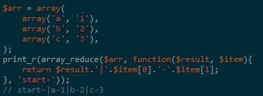

# 与变量和类型有关的扩展- Array(数组)

这些函数允许你通过不同的方式来使用和操作数组。数组是存储、管理和操作变量组的必不可少的工具。 

PHP 支持简单数组和多维数组，数组可由用户自己创建也可以由其它函数创建。有很多特殊的数据库处理函数可以从数据库查询中返回数组以及一些返回数组的函数。 

内置

配置

## 定义常量

大小写:

CASE_LOWER (integer) 
     CASE_LOWER 用在 array_change_key_case() 中将数组的键名转换成小写字母。这也是 array_change_key_case() 的默认值。 
CASE_UPPER (integer) 
     CASE_UPPER 用在 array_change_key_case() 中将数组的键名转换成大写字母。 

排序顺序标识： 

SORT_ASC (integer) 
     SORT_ASC 用在 array_multisort() 函数中，使其升序排列。 
SORT_DESC (integer) 
     SORT_DESC 用在 array_multisort() 函数中，使其降序排列。 

排序类型标识：用于各种排序函数 

SORT_REGULAR (integer) 
     SORT_REGULAR 用于对对象进行通常比较。 
SORT_NUMERIC (integer) 
     SORT_NUMERIC 用于对对象进行数值比较。 
SORT_STRING (integer) 
     SORT_STRING 用于对对象进行字符串比较。 
SORT_LOCALE_STRING (integer) 
     SORT_LOCALE_STRING 基于当前区域来对对象进行字符串比较。PHP 4.4.0 和 5.0.2 新加。 

COUNT_NORMAL (integer) 
COUNT_RECURSIVE (integer) 

EXTR_OVERWRITE (integer) 
EXTR_SKIP (integer) 
EXTR_PREFIX_SAME (integer) 
EXTR_PREFIX_ALL (integer) 
EXTR_PREFIX_INVALID (integer) 
EXTR_PREFIX_IF_EXISTS (integer) 
EXTR_IF_EXISTS (integer) 
EXTR_REFS (integer) 

## 函数 

`array array_change_key_case ( array $input [, int $case = CASE_LOWER ] )`

将 input 数组中的所有键名改为全小写或大写。改变是根据后一个选项 case 参数来进行的。本函数不改变数字索引
[一维]返回数组的键值全为大写或者小写形式,第二个参量为常数,CASE_UPPER|CASE_LOWER

`array array_chunk ( array $input , int $size [, bool $preserve_keys = false ] )`

将数组根据长度分解为多个单元
可以选择是否保留键值

`array array_column ( array $input , mixed $column_key [, mixed $index_key ] )`

[5.5.0]根据输入的列 "key" 返回输入数组的单列, 如果给定索引的键, 则返回一个以 index_key 为键, column_key 为值的一维数组

`array array_combine ( array $keys , array $values )`

返回一个 array，用来自 keys 数组的值作为键名，来自 values 数组的值作为相应的值
[一维]组合键值和单元,如果键组和单元组长度不同返回false

`array array_count_values ( array $input )`

统计数组中所有值出现的次数
[一维]统计数组中单元值出现的次数

`array array_diff ( array $array1 , array $array2 [, array $... ] )`

对比返回在 array1 中但是不在 array2 及任何其它参数数组中的值

`array array_diff_assoc ( array $array1 , array $array2 [, array $... ] )`

带索引计算数组之间的差集

`array array_udiff ( array $array1 , array $array2 [, array $ ... ], callable $data_compare_func )`

用回调函数比较数据来计算数组的差集

`array array_udiff_assoc ( array $array1 , array $array2 [, array $ ... ], callable $data_compare_func )`

带索引检查计算数组的差集，用回调函数比较数值

`array array_udiff_uassoc ( array $array1 , array $array2 [, array $ ... ], callable $data_compare_func , callable $key_compare_func )`

带索引检查计算数组的差集，用回调函数比较数据和索引

`array array_diff_key ( array $array1 , array $array2 [, array $... ] )`

使用键名比较数组之间的差集

`array array_diff_uassoc ( array $array1 , array $array2 [, array $... ], callable $key_compare_func )`

用用户提供的回调函数做索引检查来计算数组的差集
- int callback ( mixed $a, mixed $b )
    在第一个参数小于，等于或大于第二个参数时，该比较函数必须相应地返回一个小于，等于或大于 0 的整数。 

`array array_diff_ukey ( array $array1 , array $array2 [, array $ ... ], callable $key_compare_func )`

用回调函数对键名比较计算数组的差集
- int callback ( mixed $a, mixed $b )
    在第一个参数小于，等于或大于第二个参数时，该比较函数必须相应地返回一个小于，等于或大于 0 的整数。 

`array array_fill_keys ( array $keys , mixed $value )`

使用 value 参数的值作为值，使用 keys 数组的值作为键来填充一个数组

`array array_fill ( int $start_index , int $num , mixed $value )`

用 value 参数的值将一个数组填充 num 个条目，键名由 start_index 参数指定的开始

`array array_filter ( array $input [, callable $callback = "" ] )`

依次将 input 数组中的每个值传递到 callback 函数。如果 callback 函数返回 TRUE，则 input 数组的当前值会被包含在返回的结果数组中。数组的键名保留不变

`array array_flip ( array $trans )`

`array_flip()` 返回一个反转后的 array，例如 trans 中的键名变成了值，而 trans 中的值成了键名, 键.单元 互换

`array array_intersect ( array $array1 , array $array2 [, array $ ... ] )`

返回一个数组，该数组包含了所有在 array1 中也同时出现在所有其它参数数组中的值。注意键名保留不变。 

`array array_intersect_assoc ( array $array1 , array $array2 [, array $ ... ] )`

返回一个数组，该数组包含了所有在 array1 中也同时出现在所有其它参数数组中的值。注意和 `array_intersect()` 不同的是键名也用于比较。 

`array array_intersect_key ( array $array1 , array $array2 [, array $ ... ] )`

返回一个数组，该数组包含了所有出现在 array1 中并同时出现在所有其它参数数组中的键名的值。 

`array array_intersect_uassoc ( array $array1 , array $array2 [, array $ ... ], callable $key_compare_func )`

返回一个数组，该数组包含了所有在 array1 中也同时出现在所有其它参数数组中的值。注意和 `array_intersect()` 不同的是键名也用于比较。 
     
`array array_intersect_ukey ( array $array1 , array $array2 [, array $... ], callable $key_compare_func )`

array_intersect_ukey() 返回一个数组，该数组包含了所有出现在 array1 中并同时出现在所有其它参数数组中的键名的值。 

`array array_uintersect ( array $array1 , array $array2 [, array $ ... ], callable $data_compare_func )`

计算数组的交集，用回调函数比较数据

`array array_uintersect_assoc ( array $array1 , array $array2 [, array $ ... ], callable $data_compare_func )`

带索引检查计算数组的交集，用回调函数比较数据

`array array_uintersect_uassoc ( array $array1 , array $array2 [, array $ ... ], callable $data_compare_func , callable $key_compare_func )`

带索引检查计算数组的交集，用回调函数比较数据和索引

`bool array_key_exists ( mixed $key , array $search )`

[alias] key_exists
在给定的 key 存在于数组中时返回 TRUE。key 可以是任何能作为数组索引的值。 array_key_exists() 也可用于对象。 

`array array_keys ( array $input [, mixed $search_value = NULL [, bool $strict = false ]] )`

返回 input 数组中的数字或者字符串的键名
     
`array array_map ( callable $callback , array $arr1 [, array $... ] )`

返回一个数组，该数组包含了 arr1 中的所有单元经过 callback 作用过之后的单元。callback 接受的参数数目应该和传递给 array_map() 函数的数组数目一致

`array array_merge_recursive ( array $array1 [, array $... ] )`

递归地合并一个或多个数组

`array array_merge ( array $array1 [, array $... ] )`

合并一个或多个数组

`bool array_multisort ( array &$arr [, mixed $arg = SORT_ASC [, mixed $arg = SORT_REGULAR [, mixed $... ]]] )`

可以用来一次对多个数组进行排序，或者根据某一维或多维对多维数组进行排序
关联（string）键名保持不变，但数字键名会被重新索引。 
两个数组排序是,一句上一个数组的最后两位(排序之后),或者下一个数组的之前两位

`array array_pad ( array $input , int $pad_size , mixed $pad_value )`

用值将数组填补到指定长度 

`mixed array_pop ( array &$array )`

弹出并返回 array 数组的最后一个单元

`number array_product ( array $array )`

计算数组中所有值的乘积
     array_product(array()) = 1

`int array_push ( array &$array , mixed $var [, mixed $... ] )`

将一个或多个单元压入数组的末尾（入栈）
如果第一个参数不是数组， array_push() 将发出一条警告。这和 $var[] 的行为不同，后者会新建一个数组。
如果用 array_push() 来给数组增加一个单元，还不如用 $array[] = ，因为这样没有调用函数的额外负担。 
     
`mixed array_rand ( array $input [, int $num_req = 1 ] )`

从数组中随机取出一个或多个单元

`mixed array_reduce ( array $input , callable $function [, mixed $initial = NULL ] )`

将回调函数 function 迭代地作用到 input 数组中的每一个单元中，从而将数组简化为单一的值

`array array_replace_recursive ( array $array , array $array1 [, array $... ] )`

[5.3.0]使用传递的数组递归替换第一个数组的元素

`array array_replace ( array $array , array $array1 [, array $... ] )`

[5.3.0]使用传递的数组替换第一个数组的元素

`array array_reverse ( array $array [, bool $preserve_keys = false ] )`

返回一个单元顺序相反的数组

`mixed array_search ( mixed $needle , array $haystack [, bool $strict = false ] )`

在数组中搜索给定的值，如果成功则返回相应的键名

`mixed array_shift ( array &$array )`

将 array 的第一个单元移出并作为结果返回，将 array 的长度减一并将所有其它单元向前移动一位。所有的数字键名将改为从零开始计数，文字键名将不变。 

`array array_slice ( array $array , int $offset [, int $length = NULL [, bool $preserve_keys = false ]] )`

从数组中格局位置和长度取出一段

`array array_splice ( array &$input , int $offset [, int $length = 0 [, mixed $replacement ]] )`

将数组中的一部分去掉并用其他值替代, 如果replacement是字串, 将被转换为数组 (array) $parameter

`number array_sum ( array $array )`

计算数组中所有值的和

`array array_unique ( array $array [, int $sort_flags = SORT_STRING ] )`

移除数组中重复的值

`int array_unshift ( array &$array , mixed $var [, mixed $... ] )`

在数组开头插入一个或多个单元 

`array array_values ( array $input )`

返回数组中所有的值

`bool array_walk_recursive ( array &$input , callable $funcname [, mixed $userdata = NULL ] )`

将用户自定义函数 funcname 应用到 array 数组中的每个单元。本函数会递归到更深层的数组中去。 

`bool array_walk ( array &$array , callable $funcname [, mixed $userdata = NULL ] )`

对数组中的每个成员应用用户函数
array_map 是 处理多个数组为一个数组, array_walk 是 处理原数组

`array array ([ mixed $... ] )`

创建一个数组
     不是类,不使用new来生成

`bool arsort ( array &$array [, int $sort_flags = SORT_REGULAR ] )`

对数组进行逆向排序并保持索引关系

`bool asort ( array &$array [, int $sort_flags = SORT_REGULAR ] )`

对数组进行排序并保持索引关系

`array compact ( mixed $varname [, mixed $... ] )`

压缩变量到数组
建立一个数组，包括变量名和它们的值,此函数和函数extract()函数用法完全相反
该函数不能将超全局变量放入到里边去形成一个新的数组,该数组将变量名称作为兼职,变量值为子值

`int count ( mixed $var [, int $mode = COUNT_NORMAL ] )`

[alias] sizeof
计算数组中的单元数目或对象中的属性个数
计算数组的数目或者是安装了spl中实现了countable接口的对象的属性的个数
该函数可以设置第二个参数来递归计数数组内值个数

`mixed current ( array &$array )`

[alias] pos
返回数组中的当前单元

`array each ( array &$array )`

返回数组中当前的键／值对并将数组指针向前移动一步

`mixed end ( array &$array )`

将数组的内部指针指向最后一个单元

`int extract ( array &$var_array [, int $extract_type = EXTR_OVERWRITE [, string $prefix = NULL ]] )`

从数组中将变量导入到当前的符号表

`bool in_array ( mixed $needle , array $haystack [, bool $strict = FALSE ] )`

检查数组中是否存在某个值

`mixed key ( array &$array )`

从关联数组中取得键名

`mixed next ( array &$array )`

将数组中的内部指针向前移动一位 

`mixed prev ( array &$array )`

将数组的内部指针倒回一位

`mixed reset ( array &$array )`

将数组的内部指针指向第一个单元

`bool krsort ( array &$array [, int $sort_flags = SORT_REGULAR ] )`

对数组按照键名逆向排序

`bool ksort ( array &$array [, int $sort_flags = SORT_REGULAR ] )`

对数组按照键名排序

`bool rsort ( array &$array [, int $sort_flags = SORT_REGULAR ] )`

对数组逆向排序

`array list ( mixed $varname [, mixed $... ] )`

把数组中的值赋给一些变量

`bool natcasesort ( array &$array )`

用“自然排序”算法对数组进行不区分大小写字母的排序

`bool natsort ( array &$array )`

用“自然排序”算法对数组排序

`array range ( mixed $start , mixed $limit [, number $step = 1 ] )`

建立一个包含指定范围单元的数组

`bool shuffle ( array &$array )`

本函数打乱（随机排列单元的顺序）一个数组

`bool sort ( array &$array [, int $sort_flags = SORT_REGULAR ] )`

对数组排序

`bool uasort ( array &$array , callable $cmp_function )`

用用户自定义的比较函数对数组中的值进行排序并保持索引关联

`bool uksort ( array &$array , callable $cmp_function )`

使用用户自定义的比较函数对数组中的键名进行排序

`bool usort ( array &$array , callable $cmp_function )`

使用用户自定义的比较函数对数组中的值进行排序

