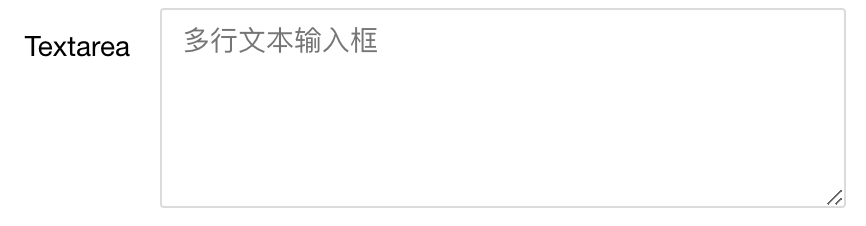
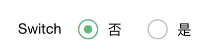
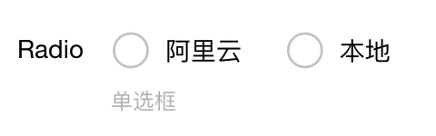
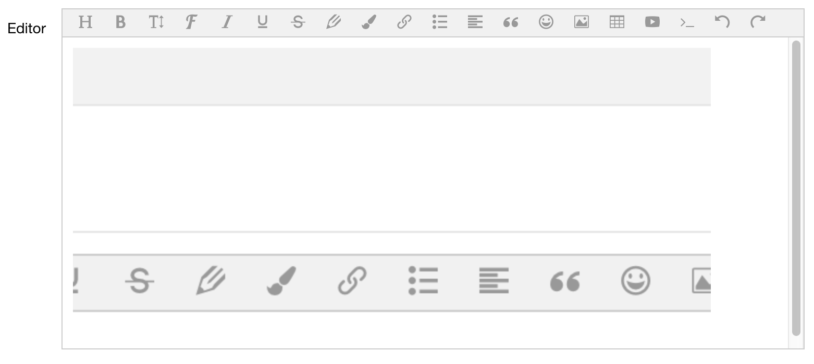

# Module : 模块配置

## 位置

配置文件放置于模块中, 采用 yaml 语法, 位置如下, `{module}` 代表模块名称

```
~/modules/{module}/configurations/pages.yaml
```

## 定义

### 配置文件示例

```
system:
    initialization:
        name: 系统设置
        path: system
        tabs: true
    tabs:
        site:
            default : true
            show: true
            title: 站点设置
            fields:
                name:
                    default: ''
                    label: 网站名称
                    key: system::site.name
                    placeholder: 请输入网站名称
                    type: input
                title:
                    default: ' '
                    label: 网站标题
                    key: system::site.title
                    placeholder: 请输入网站标题, 将显示在标题栏中
                    type: input
```

### key 定义格式

设置定义 key 的格式为

```
namespace::group.item
    namespace   : 命名空间
        这里一般采用模块名称来进行命名 system, user
    group       : 分组名称
    item        : 条目信息(字符串)
```

## 配置支持的类型

### input

代表是输入框

```
default: ''
description: ''
label: Input
key: sample::site.input
placeholder: 这里是 input 输入框的占位内容
required: true
type: input
```


### textarea

文本输入框, 多行文本

```
default: ''
label: Textarea
key: sample::site.textarea
placeholder: 多行文本输入框
type: textarea
```




### switch

切换开关

```
default: ''
label: Switch
key: sample::site.switch
placeholder: 开关切换
type: switch
```




### picture

图片输入框类型

```
default: ' '
label: Picture
key: sample::site.picture
placeholder: 这里是上传图片的
type: picture
```


### radio

单选框, 支持的选项通过key opinions 定义

```
default: 'aliyun'
description: '单选框'
label: Radio
key: sample::site.radio
type: radio
opinions:
    aliyun: 阿里云
    local: 本地
```




### checkbox

多选框, 支持的选项通过 key opinions 来定义

```
default: 'aliyun,local'
description: '多选框'
label: Checkbox
key: sample::site.checkbox
type: checkbox
opinions:
    aliyun: 阿里云
    local: 本地
```


### editor

富文本编辑器

```
default: ' '
label: Editor
key: sample::site.editor
placeholder: 编辑器
type: editor
```




### hook

钩子

```
default: ' '
label: Hook
key: sample::site.hook
type: hook
hook: 'ad.form_place_selection'
```


## 使用

### 更新缓存

进行完成配置之后需要进行缓存的更新

```
php artisan cache:clear
```

### 调用

使用系统内置的函数来进行调用

```
sys_setting('system::site.name')
```
