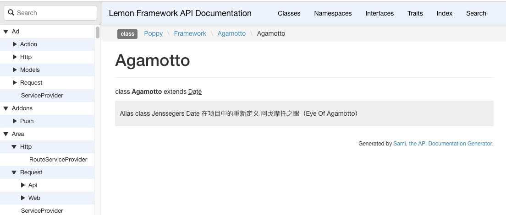

# System : 如何生成 php 文档

## 生成配置文件

```
$ php artisan vendor:publish
 Which provider or tag's files would you like to publish?:
  ...
  [20] Tag: poppy-framework
  [21] Tag: poppy-module
 > 21
Copied File [/modules/system/resources/config/sami.php] To [/storage/sami/config.php]
Publishing complete.
```

## 下载 sami

首先下载 sami , 放到 `storage/sami/sami.phar` 这个位置
或者使用命令来下载, 如果不知道命令可以运行 `php artisan system:doc sami`
来查看下载文件的命令

```
$ php artisan system:doc sami

Please Run Command To Install Sami.phar:
curl http://get.sensiolabs.org/sami.phar --output /data/workbench/www/wulicode/storage/sami/sami.phar
```

来查看下载的命令是什么

## 生成文档

这样在 `resources/sami/` 目录下便会有两个文件 `sami.phar` 和 `sami.php`
我们可以运行 `php artisan system:doc sami` 来查看下生成文档的命令

```
$ php artisan system:doc sami
Please Run Command:
php /data/workbench/www/wulicode/storage/sami/sami.phar update /data/workbench/www/wulicode/storage/sami/config.php
```

我们运行命令来生成 php 文档

由于 sami 最新版是基于 php7.1 版本的, 所以我们必须以相应的版本来运行.
如果版本不正确则无法运行

```
$ php71 /data/workbench/www/wulicode/storage/sami/sami.phar update /data/workbench/www/wulicode/storage/sami/config.php
 Updating project 

Version master
  Parsing   done
  Rendering done

 Version    Updated C    Removed C 
   master         1224            0

 Version    Updated C    Updated N    Removed C    Removed N 
   master            2            0            0            0
```

运行完成后会在 `public/docs/php` 文件夹下生成标准的html 文档,
这样我们就可以进行访问了.

如果默认的配置无法满足你的要求可以编辑 `resources/sami/sami.php`
文件来修改需要生成文档的文件夹和目标路径.

生成文档如下




## 附录

### sami.php 源文件

``` {.php}
<?php

// config/sami.php
// php ./resources/sami/sami.phar update ./resources/sami/config.php

$baseDir          = dirname(dirname(__DIR__));
$folders          = glob($baseDir . '/{extensions,modules}/*/src', GLOB_BRACE);
$addonFolders     = glob($baseDir . '/{addons}/*/*/src', GLOB_BRACE);
$frameworkFolders = glob($baseDir . '/{framework}/src', GLOB_BRACE);
$vendorFolders    = glob($baseDir . '/vendor/poppy/**/src', GLOB_BRACE);

$folders = array_merge($folders, $addonFolders, $frameworkFolders);

$excludes = [];
foreach ($folders as $folder) {
    $excludes[] = $folder . '/database/seeds';
    $excludes[] = $folder . '/database/migrations';
    $excludes[] = $folder . '/database/factories';
    $excludes[] = $folder . '/update';
}

$iterator = Symfony\Component\Finder\Finder::create()
    ->files()
    ->name('*.php')
    ->exclude('database')
    ->exclude('update')
    ->in($folders);

$options = [
    'theme'     => 'default',
    'title'     => 'Lemon Framework API Documentation',
    'build_dir' => $baseDir . '/public/docs/php',
    'cache_dir' => $baseDir . '/storage/sami/cache',
];

return new \Sami\Sami($iterator, $options);
```

### 使用低版本的php 会报的错误

> | Parse error: syntax error, unexpected \'?\', expecting variable
>   (T\_VARIABLE) in
>   phar:///data/workbench/www/wulicode/storage/sami/sami.phar/vendor/symfony/console/Output/Output.php
>   on line 40

这里报错是因为 sami.phar 使用了php7.1 的语法结构, 导致老版本的php
无法解析.
