# [译] 常用 Phpstorm tips (上/共3部分)
摘自: [Phpstorm Tips](https://phpstorm.tips)

## 1. 鼠标所在位置的持续性多选

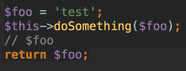

按下 `Alt+J` 将光标所在位置的单词选择下一个并且添加到当前的选择项中, 重复以上步骤添加更多单词.

按下 `Shift+Alt+J` 移除最后一个添加的单词.

**Mac 快捷键**

按下 `Ctrl+G` 添加新位置
按下 `Shift+Ctrl+G` 移除最后的添加项

- [Selecting Text in the Editor](https://www.jetbrains.com/help/phpstorm/2016.2/selecting-text-in-the-editor.html#d940536e270)

## 2. 鼠标区块选择

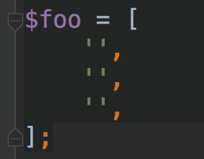

按下 `Alt` 并且拖动鼠标来选择多行区域. 你还可以通过拖动来创建一个包含跨多行选择的文本的选择框。

* [Selecting Text in the Editor](https://www.jetbrains.com/help/phpstorm/2016.2/selecting-text-in-the-editor.html#d940536e270)

## 3 滚动到项目面板的文件位置

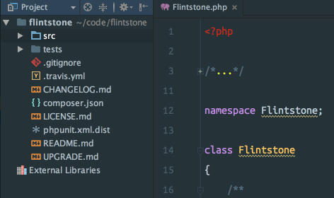

要在项目面板中找到当前文件，请按 `Scroll from source` 按钮在项目树中找到该文件并将其滚动到可见位置。

* [Project Tool Window](https://www.jetbrains.com/help/phpstorm/2016.3/project-tool-window.html#d846472e675)

## 4. 搜索类方法

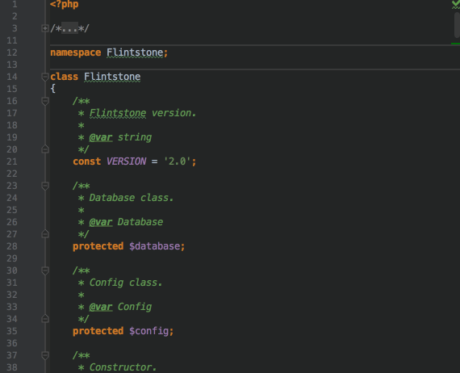

要快速跳转到打开文件中的方法或属性，请按 `Ctrl+F12` 打开 *File Structure* 窗口，然后可以 *模糊搜做* 想要的方法。

文件结构窗口也可以通过在菜单中切换到 **Navigate | File Structure** 来打开。

### 比 Ctrl+F 好用

这比使用 `Ctrl+F` 搜索更准确，因为搜索是一个简单的文本搜索，它将找到成员用法和成员声明，几乎总是导致你在到达定义之前按几次Enter键。文件结构视图总是直接将您带到方法定义的位置.

**Mac 快捷键**

按下 `Cmd+F12` 来打开文件结构窗口

## 5. 跳转到 上一个/下一个 方法

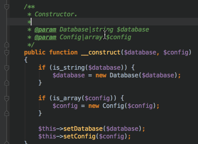

按下 `Alt+Up/Alt+Down` 来跳转到当前类中的上一个/下一个方法

这些操作可以在 **Navigate | Next Method / Previous Method** 找到

**PS:** 你可以通过相同的快捷键跳转到 上一个/下一个 Html标签

**Mac 快捷键**

按下 `Ctrl+Up/Ctrl+Down` 来跳转到上一个/下一个方法

* [Navigating Between Methods and Tags](https://www.jetbrains.com/help/phpstorm/2016.2/navigating-between-methods-and-tags.html)

## 6. 查看文档

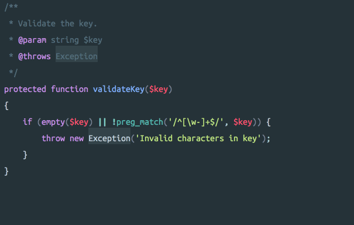

当鼠标在方法上, 按下 `Ctrl+Q` 弹出 `快速文档窗口`, 并且显示该方法对应的文档, 按 `Esc` 关闭弹出窗口.

对于内置的 PHP 方法, 按下 `Shift+F1` 在浏览器中在[php.net](http://www.php.net/) 打开该方法的函数介绍

这些操作在如下菜单中 - **View | Quick Documentation Lookup** - **View | External documentation**

**Mac 快捷键**

按 `F1` 以显示快速文档弹出窗口。
按 `Shift+F1` 打开外部文档。

* [Viewing Inline Documentation](https://www.jetbrains.com/help/phpstorm/2016.2/viewing-inline-documentation.html)
* [Viewing External Documentation](https://www.jetbrains.com/help/phpstorm/2016.2/viewing-external-documentation.html)

## 7. 显示参数信息

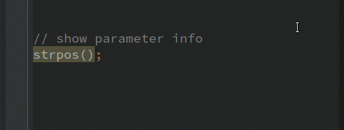

很难记住一个函数的参数顺序, 例如 haystack / needle 的先后顺序. 

将鼠标定位在函数调用的圆括号内，并按 `Ctrl+P` 显示函数的参数。

这在知道调用函数而不知道参数是什么的时候很有用，或者在查看代码时想要确定哪个参数是什么值。

参数信息操作在 : **View | Parameter Info**

**Mac 快捷键**

按下 `Cmd+P` 来显示函数参数

* [Viewing Method Parameter Information](https://www.jetbrains.com/help/phpstorm/2016.2/viewing-method-parameter-information.html)

## 8. 跳转到匹配的括号

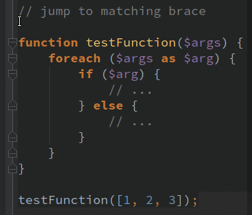

将鼠标放到代码块内的任何位置，并按 `Ctrl+Shift+M` 将光标跳转到匹配的大括号中。

括号包括 `{}`,`[]`, `()` 和 HTML 标签。

**Mac 快捷键**

按 `Ctrl+M` 来跳转到匹配的括号

* [Navigating to Braces](https://www.jetbrains.com/help/phpstorm/2016.2/navigating-to-braces.html)

## 9.  添加, 删除 & 复制行

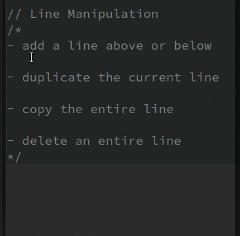

`Shift+Enter` 在当前行后添加新行.
`Ctrl+Alt+Enter` 在当前行前添加新行.
`Ctrl+D` 复制当前行.
当鼠标没有选择内容的时候按下 `Ctrl+C/X` 来复制/剪切 当前行到粘贴板. 
按下 `Ctrl+Y` 来删除当前行.

**Mac 快捷键**
`Shift+Enter` 在当前行后添加新行.
`Cmd+Alt+Enter` 在当前行前添加新行.
`Cmd+D` 复制当前行.
当鼠标没有选择内容的时候按下 `Cmd+C/X` 来复制/剪切 当前行到粘贴板. 
按下 `Cmd+Backspace` 来删除当前行.

* [Adding, Deleting and Moving Code Elements](https://www.jetbrains.com/help/phpstorm/2016.2/adding-deleting-and-moving-code-elements.html)

## 10. 跳转到声明/定义位置

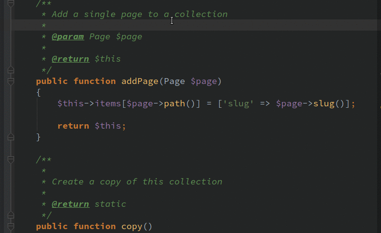

要导航到标识（变量，方法，类等）的定义位置，请按住 Ctrl 键，同时将鼠标指针悬停在符号上以将其转换为超链接，然后单击标识跳转到定义的位置。

您也可以在光标位于标识上时按 `Ctrl+B`，或在菜单中点击 **Navigate | Declaration**

**Mac 快捷键**

按住 Cmd 键并单击以导航到定义位置。按 Cmd+B 导航到定义位置。

* [Navigating to Declaration](https://www.jetbrains.com/help/phpstorm/2016.3/navigating-to-declaration-or-type-declaration-of-a-symbol.html)

## 11. 切换大小写

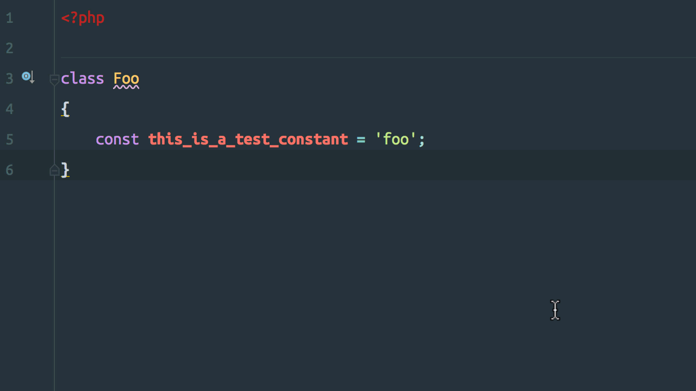

选中文本并, 使用 `Ctrl+Shift+U` 来切换选中文本的大小写.

你可以使用 **Edit | Toggle Case** 操作

**Mac 快捷键**

使用 `Cmd+Shift+U` 来切换选中文本的大小写.

* [Toggling Case](https://www.jetbrains.com/help/phpstorm/2016.3/toggling-case.html)

## 12 从历史记录粘贴

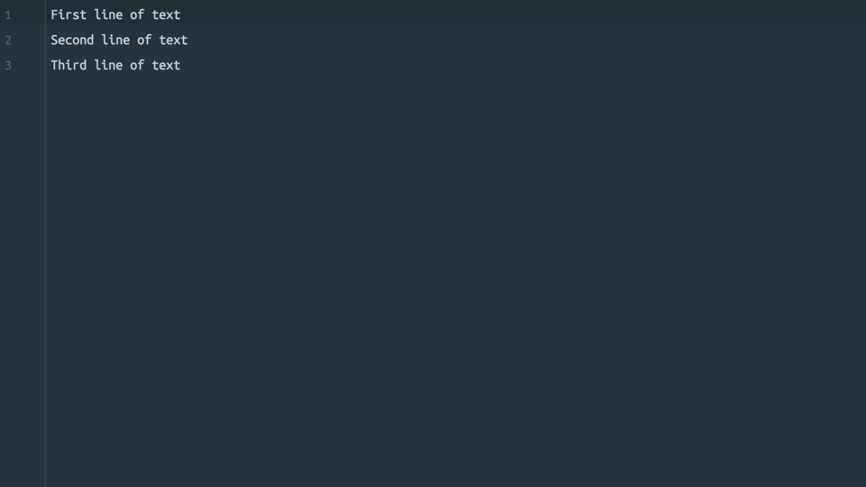

PhpStorm 在剪贴板中保存一个最近条目的列表。按 `Cmd+Shift+V` 查看剪贴板条目列表。

剪贴板历史也可以从菜单中打开: **Edit | Paste from history **

添加一些内容到粘贴板会添加到列表的顶部. 从粘贴板中粘贴以往的历史记录也会把这条记录在历史记录中置顶. 

可以通过选择条目并按 `Delete` 键从历史记录列表中删除条目。

**Windows/Linux**

使用 `Ctrl+Shift+V` 查看剪贴板历史条目.

* [Cutting, Copying and Pasting](https://www.jetbrains.com/help/phpstorm/2016.3/cutting-copying-and-pasting.html#d972203e480)

## 13. 导航到类

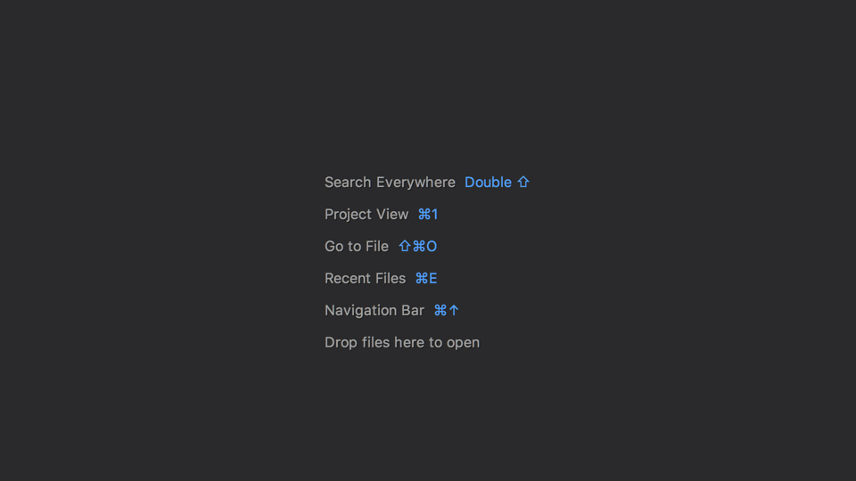

按 Cmd+O 调用 “Open Class” 对话框并开始输入以查找项目中的任何类。

这是一种非常快速和精确的导航方法，不应该被忽视。

### 模糊搜索

如果搜索项返回的结果太多，您可以使用 *模糊搜索*  添加到搜索项中并缩小结果范围。

PhpStorm将识别搜索词中的任何大写字母，并尝试将这些字母与使用CamelCasing命名的类相关联。

如上面的录屏所示， `HomepageController` 可以通过搜索 `Homepage` 或模糊搜索 “HomeCont” 来打开。

如果仍然返回太多结果，则命名空间可以包含在搜索项中。示例中的完全限定类名称  `App\Http\Controllers\HomepageController`，因此可以尝试搜索 `Contr\Home`，它将匹配类名的 `Controllers\HomepageController` 部分，甚至可以搜索 ‘A\H\C\HC’ 来进行更有创意的搜索

### Windows/Linux 快捷键

按 Ctrl+N 调用 `Open Class` 对话框。

* [Navigating to Class, File or Symbol by Name](https://www.jetbrains.com/help/phpstorm/2016.3/navigating-to-class-file-or-symbol-by-name.html)

## 14 打开类的指定行

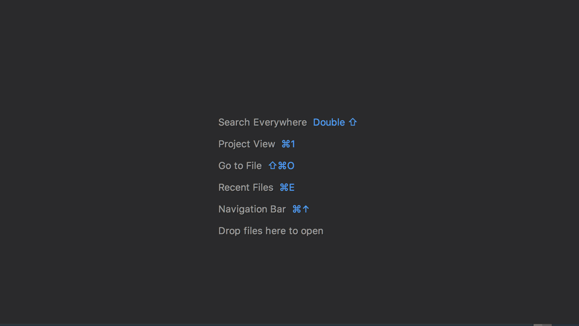

这个技巧建立在上一个技巧之上 (#13 导航到类)

使用 `Open Class`（或`Open File`）打开对话框时，可以使用 `:123` 为搜索查询添加后缀，以跳转到所选文件中指定的行号。

当在 PhpUnit，CI 服务器 或错误监视服务中引发错误并且您希望从堆栈跟踪导航到文件和行号时，这非常有用。

* [Navigating to Class, File or Symbol by Name](https://www.jetbrains.com/help/phpstorm/2016.3/navigating-to-class-file-or-symbol-by-name.html#tips)

## 15 自动滚动到项目文件位置

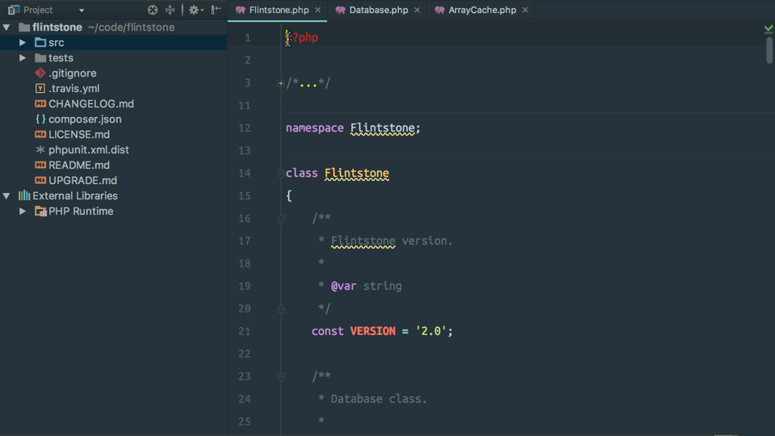

此提示按钮在提示＃3的头部位置。

要自动显示项目面板中的任何文件，请 在面板设置中启用 `**Autoscroll from Source**` 选项。切换到文件和在项目树中显示活动文件。

**Autoscroll to Source** 选项将自动打开在项目面板中选择的任何文件，这样只需单击即可打开文件。

* [Project Tool Window](https://www.jetbrains.com/help/phpstorm/2016.3/project-tool-window.html#title_bar_context_menu)
