# [译] 常用 Phpstorm tips (中/共3部分)
摘自: [Phpstorm Tips](https://phpstorm.tips)

## 16 替换单引号/双引号

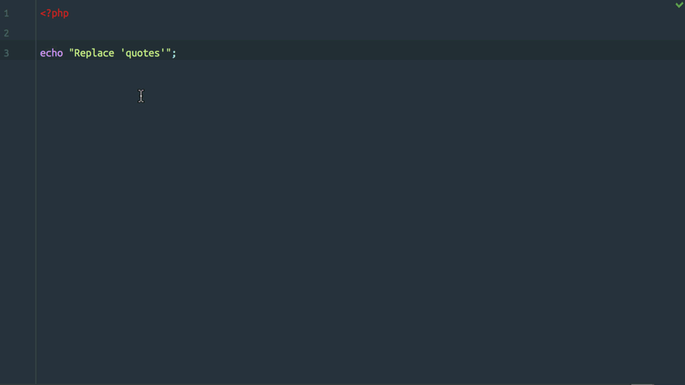

要在单引号和双引号之间切换字符串，请将光标放在字符串内的任意位置，然后按 Alt+Enter 以调用 **intention actions**  菜单，然后从菜单中选择*Replace quotes*。

PhpStorm还将识别字符串中是否有引号并使用黑色标记对其进行转义以防止格式错误的代码。


## 17 转换数组语法


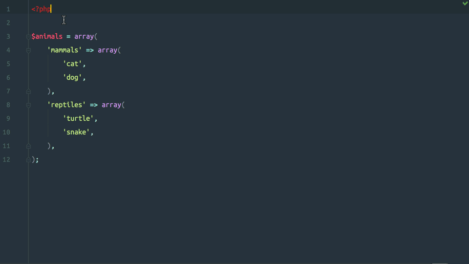

要将传统数组 `array()` 语法转换为简写 `[]` 语法，请将光标放在数组上，然后按 Alt+Enter 调用 **intention actions** 对话框，然后选择 *Convert array to short syntax* 选项。

如果数组具有嵌套数组，PhpStorm 将递归更新所有子数组。

## 18 拼写修复


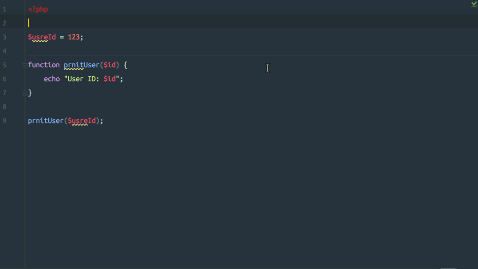

要解决你的代码的错误拼写，随时随地把光标放在拼写错误的单词，并按下 Alt+Enter 键来调用  **intention actions**  的对话框，然后选择  *Typo: Rename to…* 。

PhpStorm将通过包含文本字段的弹出窗口提示您为该单词提供正确的拼写，或者提供自动填充列表，其中包含可供选择的拼写建议供您选择。如果您不喜欢自动填充列表中的任何内容，则可以开始键入以提供您自己的单词拼写。

在修复拼写错误时最好利用PhpStorm，因为它会在整个代码库中重命名符号（变量，方法，类等）的每一次使用，从而完成所有繁重的工作。

## 19 转换比较的位置

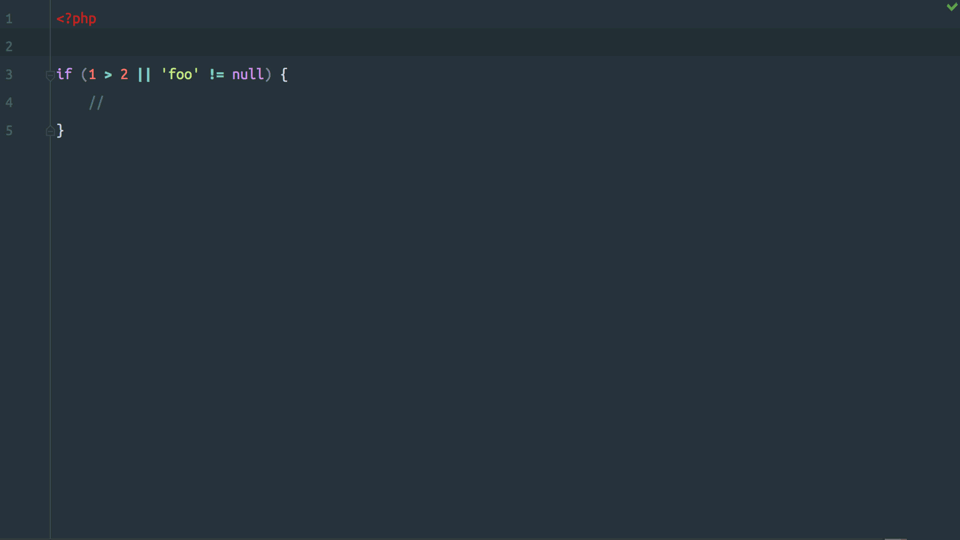


要将比较运算符两侧的值相互交换，请将光标放在运算符上，然后按 Alt+Enter 调用 **intention actions** 菜单，然后选择  *Flip ‘X’*。

某些运算符更改参数的顺序可以更改条件的语义，因此在这种情况下，PhpStorm 将在菜单中显示 *(change semantics)* 警告。当您看到此警告时，请确保您的条件仍然有意义。

## 20 生成PHPDoc文档

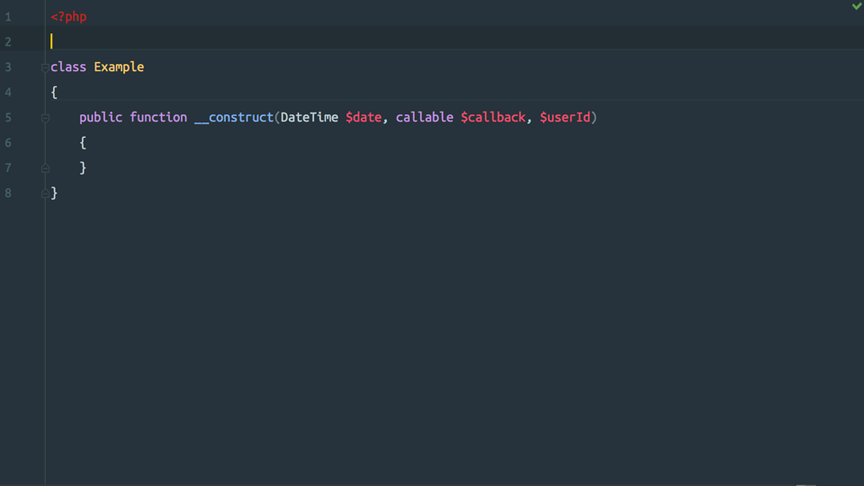

要让 PhpStorm 生成 docblock，请将光标放在方法上，然后按 Alt+Enter 调用 **intention actions** 菜单，然后选择 *Generate PHPDoc for function* . 
PhpStorm 将为 `@param` 每个参数添加标签，并从提供的类型提示中包含其数据类型。`@return` 如果指定了返回类型，它也会添加一个标记，或者它检测到该函数返回的非空值。

如果 PhpStorm 无法准确检测标签的数据类型，它将使用数据类型 `mixed` 或完全省略数据类型。在这些情况下，请记住自己提供数据类型，如果不准确，请更正。

如果函数参数发生更改，PhpStorm 还可以为您更新 docblock，只需再次调用 intent actions 菜单并选择 *Update PHPDoc Comment*.

* [Creating PHP Documentation Comments](https://www.jetbrains.com/help/phpstorm/2016.3/creating-php-documentation-comments.html)


## 21 初始化字段


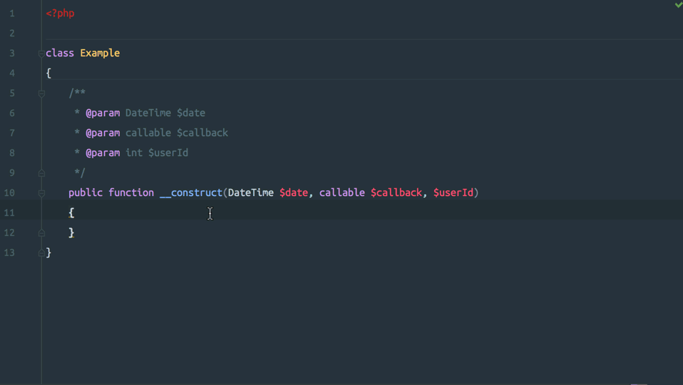


通常，传递给构造函数的参数存储在属性中，以供类的其余部分使用。PhpStorm 可以使用构造函数的方法参数创建这些属性，只需几个键击操作即可。

将光标放在构造函数的参数列表中的任意位置，然后按 Alt+Enter 以调用 **intention actions** 菜单，然后选择 *Initialize fields*。系统将提示您要选择初始化的字段,  您可以选择一个或多个字段，或按 `Ctrl/Cmd+A` 选择列表中的每个字段。

PhpStorm将为每个选定的字段创建一个新的私有属性，并在它的相应参数后命名，并使用值初始化它。它还将设置 docblock 并尝试标识识别的字段的数据类型。

## 22 Emmet


PhpStorm 已经内置了对 [Emmet](http://emmet.io/)  缩写的支持; 只需在HTML文件中键入类似CSS的缩写，然后按 `Tab` 键将其展开为完整标记。


* [Emmet Support](https://www.jetbrains.com/help/phpstorm/2016.3/emmet-support.html)
* [Emmet](http://emmet.io/)


## 23 Emmet 预览


打开设置对话框并导航到 **Editor | Emmet | HTML**,检查  *Enable abbreviation preview(启用缩写预览)* 设置。然后 PhpStorm 将在编写 Emmet 缩写时显示生成预览的弹出窗口。

* [Enabling Emmet Support](https://www.jetbrains.com/help/phpstorm/2016.3/enabling-emmet-support.html)
* [Emmet](http://emmet.io/)


## 24 代码模板


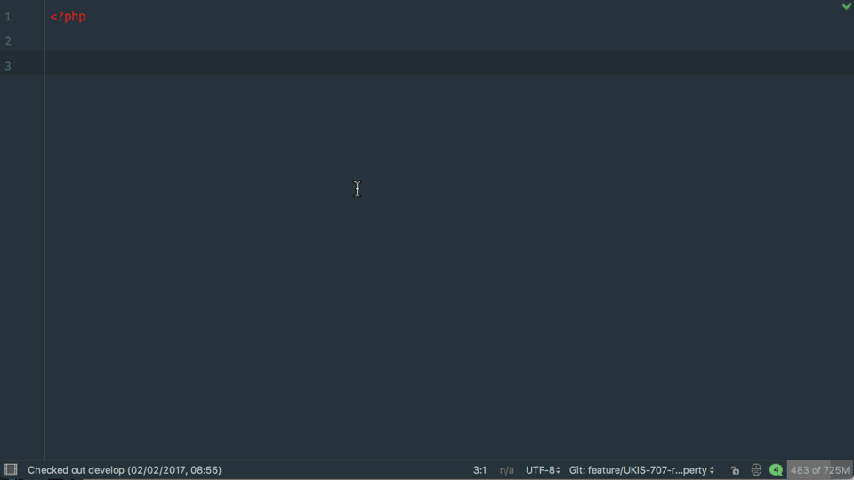


代码模板（在其他编辑器中也称为片段）允许您轻松地将常用的代码构造插入到代码中。

只需键入缩写，然后按 Tab 键将其展开为完整的代码构造。模板可以包含一个或多个变量或占位符以插入代码，按 Tab 键将光标移动到下一个变量/占位符。

按 Cmd/Ctrl+J 查看 *Insert Live Template(代码模板)*  弹出对话框，其中列出了当前文件语言的所有可用代码模板。也可以通过 **Code | Insert Live Template…**  菜单项操作。


* [Live Templates](https://www.jetbrains.com/help/phpstorm/2016.3/live-templates.html)


## 25 自定义代码模板

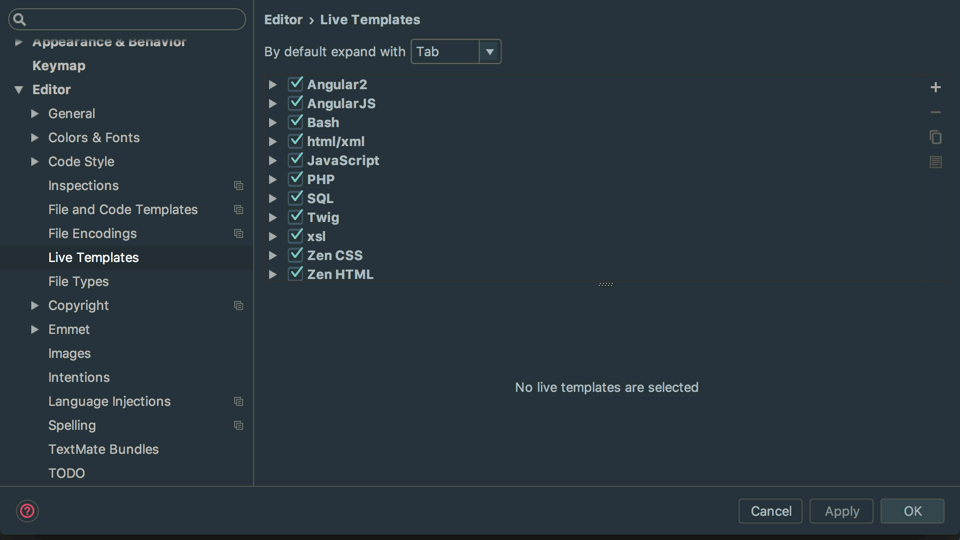


PhpStorm 允许您创建自己的代码模板（代码片段）以优化您的工作流程。

打开设置对话框并进入 **Editor | Live Templates**，你可以看到按语言分组的可用代码模板。要添加新模板，请单击 +（加号）按钮，然后选择 *Live Template*。指定缩写（你输入的文本的缩写，将扩展为完整的代码段）和描述。

然后在 *Template text* 字段中提供完整的代码段  。您可以在模板中以 `$<variable name>` 格式和`$END`变量作为特殊变量，指示在扩展模板之后光标的最终位置以及为所有变量提供的值。

接下来，单击 *Define* 以指定模板所用的语言以及可用的上下文。

现在可以使用模板了。打开文件并键入先前指定的缩写，然后单击 Tab 以展开模板。光标将定位在第一个变量上，提供一个值然后点击 Tab 以继续浏览所有可用变量。光标的最终位置将是 `$END` 变量的位置

### 示例模板

以下是可以添加到自己的工作流程的一些示例模板：


#### test: Test 方法

```
/** @test */
public function it_$NAME$()
{
    $END$
}
```

#### dd: Dump & Die

```
die(var_dump($END$));
```

#### bsinput: Bootstrap 表单输入

```
<div class="form-group">
    <label for="$ID$">$LABEL$</label>
    <input class="form-control" id="$ID$">
</div>
```

#### log: Console 日志

```
console.log($END$);
```

* [Creating and Editing Live Templates](https://www.jetbrains.com/help/phpstorm/2016.3/creating-and-editing-live-templates.html)

## 26 重命名模型


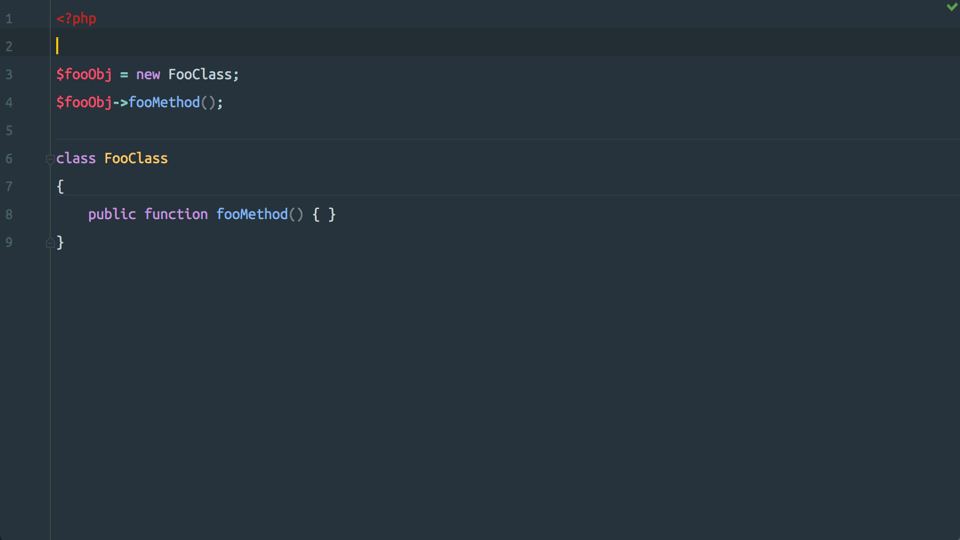


按 Ctrl+T (Windows/Linux: Ctrl+Shift+Alt+T)  调用 *Refactor This* 弹出窗口，或在菜单中选择 **Refactor | Refactor This**。

或者，按 Shift+F6 直接调用光标下标识的重命名操作。

对于某些符号，如全局范围中的变量，PhpStorm将调用重命名对话框，而不是 *in-place(实时)* 重命名符号。对于其他符号，例如类方法，PhpStorm将在  *Find tool window*  中预览更改，以便您在应用它们之前查看将要进行的更改。

* [Refactoring Source Code](https://www.jetbrains.com/help/phpstorm/2016.3/refactoring-source-code.html)
* [Rename Refactorings](https://www.jetbrains.com/help/phpstorm/2016.3/rename-refactorings.html)

## 27 找到类/方法的使用位置


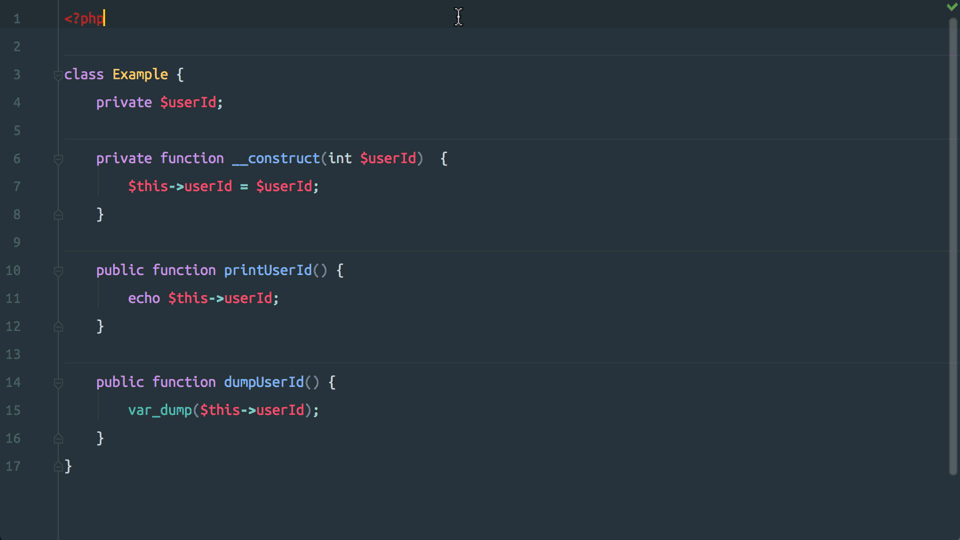


PhpStorm 可以在整个项目中找到标识符的所有使用位置; 这包括引用和实例化类的所有地方，调用方法的任何地方，字段写入和读取的所有位置等。

要查找标识符的所有用法，请按住 Cmd 键（Ctrl for Windows / Linux），然后将鼠标悬停在符号声明上以将其转换为超链接，然后单击标识符以打开 *Usages popup* ，其中将列出标识符的用法。

  图标强调了正在写一个值到标识符的用法
   图标显示从标识符读取数据的用法

或者，将光标放在符号声明上，然后按  Alt+F7 查找用法并在 *Find* 面板中打开它们。或者导航到 **Edit | Find | Find Usages**  来查找使用位置。

这与  ＃10导航到声明相同; 所以你可以用 Cmd/Ctrl 点击一个符号用法来导航到标识符声明，然后用 Cmd/Ctrl 点击标识符声明来导航到它的任何一个用法。

* [Find Usages](https://www.jetbrains.com/help/phpstorm/2016.3/finding-usages.html)
* [Viewing Usages of a Symbol](https://www.jetbrains.com/help/phpstorm/2016.3/viewing-usages-of-a-symbol.html)

## 28 变量命名建议


在编写 foreach 循环时，PhpStorm 将根据数组的名称为数组项建议合适的变量名。因此，如果您的数组被称为  $items PhpStorm将建议  $item 单项形式的条目。

PhpStorm 足够聪明，能够找出像 *people*, *octopi* 和 *oxen* 这样的单词形式; 这个单词的复数形式我还没搞清楚呢((⊙﹏⊙)b)。

奖金
您可以通过phpSuggestVariableName 在实时模板变量中合并表达式函数，在自定义实时模板中使用此功能  。


### 拓展

您可以通过 `phpSuggestVariableName` 表达式在实时模板变量使用，在自定义实时模板中使用此功能以便 PhpStorm 给你建议的单词写法。

* [Creating and Editing Template Variables](https://www.jetbrains.com/help/phpstorm/2016.3/creating-and-editing-template-variables.html)

## 29 查看文件的位置


要在工具面板（项目面板，结构面板等）中选择当前正在编辑的元素（方法，属性，文件等），请按Alt+F1 以调用 *Select In* 弹出窗口，然后选择要打开元素的面板在。

或者在菜单中打开  **Navigate | Select In…**


## 30 操作导航


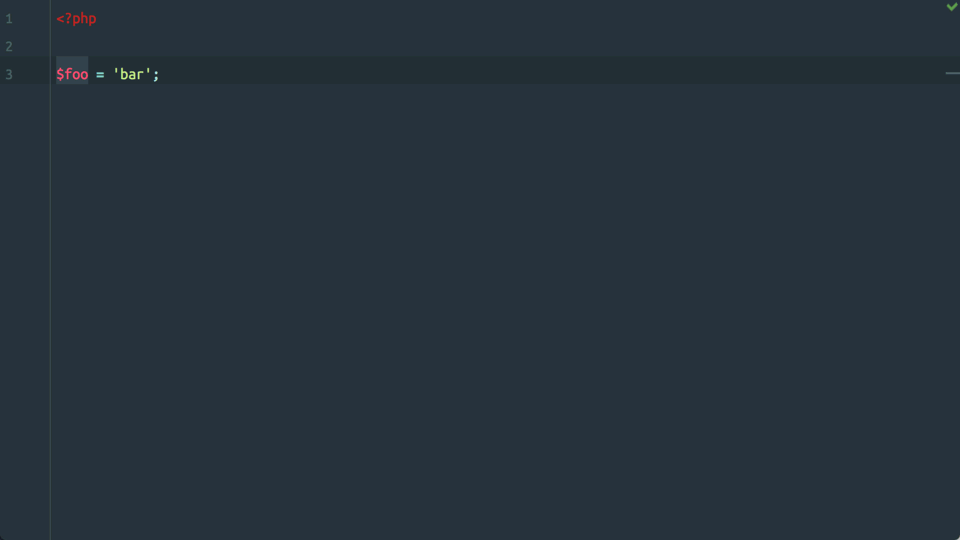


PhpStorm 允许您直接导航到所需的操作，而无需浏览菜单和工具栏，只使用键盘。它将操作定义为：

> 主菜单和各种上下文菜单的命令，通过主工具栏和工具窗口的工具栏按钮执行的命令。

按 Cmd+Shift+A（Ctrl+Shift+A on Windows/Linux）以显示 *Actions* 弹出窗口，该 弹出窗口允许你按名称搜索操作。

* [Navigating to Action](https://www.jetbrains.com/help/phpstorm/2016.3/navigating-to-action.html)