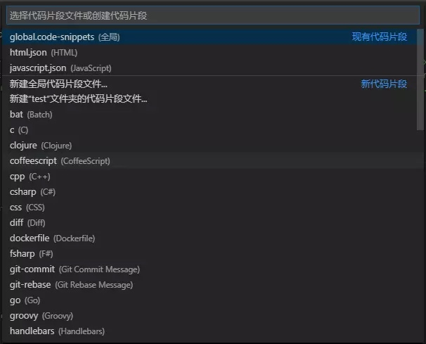
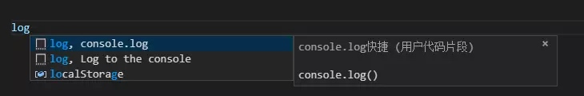
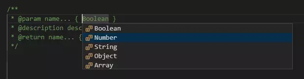
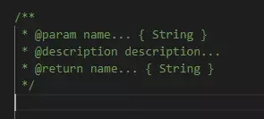

# [转] VSCode 利用 Snippets 设置超实用的代码块

原文地址 : [VSCode 利用 Snippets 设置超实用的代码块](https://juejin.im/post/5d0496415188257fff23b077)

## 一、起步

### 1. 依次点击 文件 > 首选项 > 用户代码片段

### 2. 选择代码片段或创建代码片段（可以对现有的进行修改，也可以新建代码片段）

代码片段分两种：

* ① 全局代码片段（每种语言环境下都能触发代码块）。
* ② 对应语言的局部代码片段（只能在对应语言环境下才能触发），新建全局代码片段会在 `snippets` 目录下生成 `.code-snippets` 为后缀的配置文件，而新建对应语言的代码片段会生成 `对应语言 + .json` 的配置文件。

> 下图是创建代码块的开始界面：




## 二、Snippet 语法

> 示例：`console.log` 代码块

```
"console.log": {
    "prefix": "log",
    "body": [
      "console.log($1)",
      "$2"
    ],
    "description": "console.log快捷"
  }
复制代码
```

以下说明都用上面的 `console.log` 代码块举例：

* `console.log` 对应代码片段名称。
* `prefix` 对应触发代码片段的字符。
* `body` 对应代码片段内容，可以是字符串，也可以为数组，若为数组每个元素都做为单独的一行插入。`body` 的内容支持js的转义字符，如 `\n\r` 等，我个人不建议用 `\n` ，可另起一行给数组多插入一项，不然一行太多的话不容易观察代码块的格式。
* `description` 对应代码片段描述。




如上图所示，“console.log快捷”是代码块的描述，出现在关闭icon的左边，然后下面是代码块的预览。

### 1.占位符 $

`log` 方法中 ` 后面紧跟数字可指定代码片段触发落入编辑器之后的光标位置，光标位置按照从小到大排序。 `log` 方法中当你输入 `log + TAB` 之后光标会默认落到 `log()` 的括号中（`$1` 的位置），如果此时没有手动移动光标位置，再次按 `TAB` 则光标会落到 `console.log()` 的第二行（ $2 的位置），当然，你也可以设置 `$3、$4` ... 等等。需要特别注意的是 $0 用于设置最终光标的位置，设置了 `$0` 之后，再往后设置其他占位符则不会生效， `$0` 终止了 `TAB键` 的光标跳转操作。

### 2.占位内容的可选项

```
"方法注释": {
    "prefix": "zs-Function",
    "body": [
      "/**",
      " * @param name... { ${1|Boolean,Number,String,Object,Array|} }",
      " * @description description...",
      " * @return name... { ${2|Boolean,Number,String,Object,Array|} }",
      " */",
      "$0"
    ],
    "description": "添加方法注释"
  }
复制代码
```

上面是一个简单的方法注释代码块，占位符默认不带可选项，如果要设置占位内容的可选项，写法为 `${1|a,b,c}`，括号中的 `1` 对应的是按 `TAB` 之后的光标落点顺序， `abc` 为可选的项，用逗号隔开。所以上面的代码在输入 `zs + TAB` 后第一个光标会落在 `param name... {}` 的大括号中（`$1` 的位置），如下图可以看到设置的可选项。




选择了参数类型之后，再次按 `TAB` , 光标会自动落到返回参数类型处（`$2` 的位置）并弹出可选项。如下所示：


选择了第二个选项之后，再次按 `TAB` ,光标自动落到我们配置的 `$0` 处，也就是 `*/` 的下一行：




> 需要注意的是：

* 如果可选择内容只有一个值的话可以写成 `${1:default}` 的格式。
* 占位内容支持嵌套，比如 `${1:another ${2:placeholder}}`。

### 3.变量

使用 `$name` 或者 `${name:default}` 可以插入变量的值。如果未设置变量，则会插入其默认值或空字符串。当变量未知（未定义其名称）时，会将插入的变量名称转换为占位符。

> ***VSCode 中可以使用以下变量：***

***1）文档相关：***

| 变量 | 变量含义 |
| --- | --- |
| `TM_SELECTED_TEXT` | 当前选定的文本或空字符串 |
| `TM_CURRENT_LINE` | 当前行的内容 |
| `TM_CURRENT_WORD` | 光标下的单词内容或空字符串 |
| `TM_LINE_INDEX` | 基于零索引的行号 |
| `TM_LINE_NUMBER` | 基于单索引的行号 |
| `TM_FILENAME` | 当前文档的文件名 |
| `TM_FILENAME_BASE` | 当前文档没有扩展名的文件名 |
| `TM_DIRECTORY` | 当前文档的目录 |
| `TM_FILEPATH` | 当前文档的完整文件路径 |
| `CLIPBOARD` | 剪贴板的内容 |
| `WORKSPACE_NAME` | 已打开的工作空间或文件夹的名称 |

***2）当前日期和时间：***

| 变量 | 变量含义 |
| --- | --- |
| `CURRENT_YEAR` | 当前年份 |
| `CURRENT_YEAR_SHORT` | 当前年份的最后两位数 |
| `CURRENT_MONTH` | 月份为两位数（例如'02'） |
| `CURRENT_MONTH_NAME` | 月份的全名（例如'June'）（中文语言对应六月） |
| `CURRENT_MONTH_NAME_SHORT` | 月份的简称（例如'Jun'）（中文语言对应是6月） |
| `CURRENT_DATE` | 这个月的哪一天 |
| `CURRENT_DAY_NAME` | 当天是星期几（例如'星期一'） |
| `CURRENT_DAY_NAME_SHORT` | 当天是星期几的简称（例如'Mon'）（中文对应周一） |
| `CURRENT_HOUR` | 24小时时钟格式的当前小时 |
| `CURRENT_MINUTE` | 当前分 |
| `CURRENT_SECOND` | 当前秒 |

***3）要插入行或块注释，请遵循当前语言：***

| 变量 | 变量含义 |
| --- | --- |
| `BLOCK_COMMENT_START` | 输出：PHP /*或HTML格式 |
| `LINE_COMMENT` | 输出：PHP //或HTML格式 |

举个栗子：

下面的代码块是常用的文件顶部添加作者和时间的块注释，其中用到了年（`CURRENT_YEAR`）月（`CURRENT_MONTH`）日（`$CURRENT_DATE`）的系统变量。

```
"作者和时间注释": {
    "prefix": "zs-Author & Time",
    "body": [
      "/**",
      " * Created by preference on $CURRENT_YEAR/$CURRENT_MONTH/$CURRENT_DATE",
      " */",
      "$0"
    ],
    "description": "添加作者和时间注释"
  }
复制代码
```

再举个栗子：

下面的代码块是新建 `.Vue` 文件的模板代码块，其中用到了当前文档没有扩展名的文件名（`TM_FILENAME_BASE`），默认把文件名填入 `name` 和 `class` 中。

```
 "Vue模板": {
    "prefix": "vue-template",
    "body": [
      "<template>",
      "  <section class=\"$TM_FILENAME_BASE\">",
      "    $1",
      "  </section>",
      "</template>\n",
      "<script>",
      "export default {",
      " name: '$TM_FILENAME_BASE',",
      "  data() {",
      "    return {\n",
      "    }",
      "  },",
      "  components: {},",
      "  watch: {},",
      "  mounted() {},",
      "  methods: {}",
      "}",
      "</script>\n",
      "<style scoped lang=\"less\">\n",
      "</style>",
      "$0"
    ],
    "description": "Vue模板"
  }
复制代码
```

## 三、结语

通过占位符和变量组合，各位童鞋可以充分发挥自己的想象力去设置自己喜欢的、常用的代码片段，提高开发效率和开发体验，希望这篇文章能给大家带来帮助，如有错误可在评论者提出。

参考文章：[Creating your own snippets in Visual Studio Code](https://code.visualstudio.com/docs/editor/userdefinedsnippets)

