# 正则表达式简略手册

> 澎涛整理分享 @2018.8.4

## 1. 正则

### 1.1 什么是正则表达式

正则表达式是一种特殊的字符串模式,用于匹配一组字符串, 就好比用模具做产品, 而正则就是这个模具,定义一种规则去匹配符合规则的字符。通俗的讲就是一个筛子。


### 1.2 在线匹配工具

- [https://regex101.com](https://regex101.com)
- [http://rubular.com](http://rubular.com)

## 2. 基本用法
### 2.1 界定符


正则表达式的界定符可以使用 `//`, `##`, `~~`, `@@` 等等,默认采用 `//`.

### 2.2 元字符

- `\w` : 匹配字母、数字、下划线

- `\W` : 任意一个非字母、数字、下划线的字符

- `\d` : 匹配任意一个十进制数字

- `\D` : 匹配一个非数字字符

- `\s` : 匹配任意一个空白字符, 空格、换行、回车、制表符、换页`[\f\n\r\t\v]`

- `\S` : 任意一个非空白字符

- `\b` : 匹配一个单词边界

- `\B` : 匹配非单词边界

- `|` : 选择字符，表示或者

- `[]` : 字符组,表示一个集合

```
[a-z] 匹配a-z中的任意一个字符
```

- `.` 点字符 : 匹配除了回车换行符之外的任意字符

- 匹配汉字 : 记住一个范围 `4e00 - 9fa5`
在js和PHP匹配汉字的写法不同:

```php
$regex = '/[\x{4e00}-\x{9fa5}]/u';
```
```javascript
var regex = '/[\u4e00-\u9fa5]/';
```

## 2.3 `^`, `$` 特殊符号的使用

`^` 在`[]`中，表示除了

```
[^\d], 表示除了数字之外的任意字符
```

`^`在`[]`外,表示起始的地方,`$`表示结束的地方。

```
如: /^a.*\d$/  只可以匹配已字符a开始,已数字结束的字符
```

## 2.4 量词

- `{}` 形式

  - `{n}` : 匹配n次前面的字符
  - `{n, }` : 至少匹配n次
  - `{n, m}` : 至少匹配n次，最多匹配m次

- `*`: 任意的数量,等价于 {0,}
- `+`: 至少一次,等价于{1,}
- `?`: 匹配0次或者1次

```
如: you(r)?, 可以匹配you 或者是your
```

- 注

```
元字符后面使用 ?，作为量词，表示限定字符数量为0或1.
量词后面使用 ?,表示懒惰模式.
```

## 3. 高级用法
### 3.1 懒惰模式(尽可能少的匹配)

- `*?` : 匹配任意次,但尽可能少的匹配

```
如： a.*?b 匹配 babacb只会匹配到ab
```

- `+?` : 匹配一次或多次,但尽可能少的匹配

```
如： a.+?b 匹配babacb, 会匹配到abacb
```

- `??` : 匹配0次或1次,尽可能少的匹配

```
如： a.??b 匹配babacb, 会匹配到ab
```

- `{n,m}?` : 匹配n到m次,尽可能少的匹配

```
如：a{0,6}? 匹配 aaaaaa,结果为空 因为最少是0次
```

- `{n,}?` : 至少匹配n次,尽可能少的匹配

```
如： a{2,6}? 匹配aaaaaa, 匹配到aa
```

### 3.2 贪婪模式:
```
婪模式在整个表达式匹配成功的前提下,会尽可能多的匹配符合的结果.
```

### 3.3 捕获子组 (pattern)

捕获子组就是把正则表达式中子表达式匹配的内容，保存到内存中以数字编号或显式命名的组里，方便后面引用。
```
(pattern) 匹配 pattern 并获取匹配到的内容,所获取的内容可以从产生的 Matches 集合得到,
使用 $1...$9 可获取对应分组.
```

#### 3.3.1 分类

- **普通捕获子组 (pattern)**

- **命名捕获子组(?<name>pattern)**


#### 3.3.2 捕获编号规则
捕获子组的编号是按照“(”出现的顺序，从左到右，从1开始进行编号的。由外向内，由左向右

- 正则表达式 :    `(\d{4})-(\d{2})-(\d{2})`
使用上面正则来进行日期的匹配：

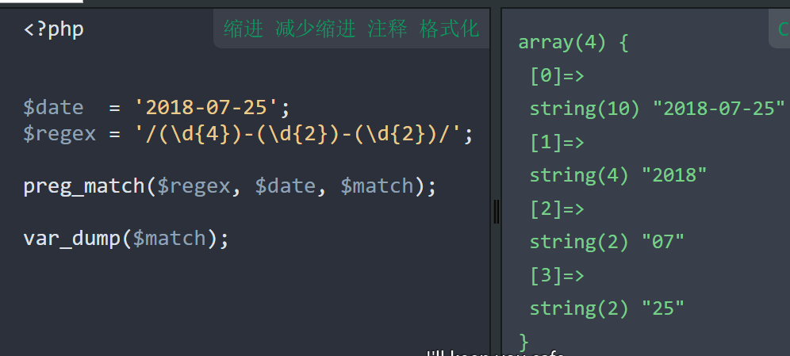


| 编号 | 捕获子组 | 匹配内容 |
| --- | --- | --- |
| 0 | `( (\d{4})-(\d{2}-(\d{2}) ) )` | 2018-07-25 |
| 1 | `(\d{4})` | 2018 |
| 2 | `(\d{2}-(\d{2}))` | 07 |
| 3 | `(\d{2})` | 25 |

- `(\d{4})-(\d{2}-(\d{2}) )`
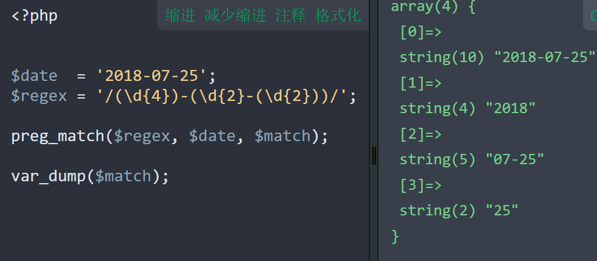


| 编号 | 捕获子组 | 匹配内容 |
| --- | --- | --- |
| 0 | `( (\d{4})-(\d{2}-(\d{2}) ) )` | 2018-07-25 |
| 1 | `(\d{4})` | 2018 |
| 2 | `(\d{2}-(\d{2}))` | 07-25 |
| 3 | `(\d{2})` | 25 |

- `((?<year>\d{4})-(?<month>\d{2})-(?<day>\d{2}))`

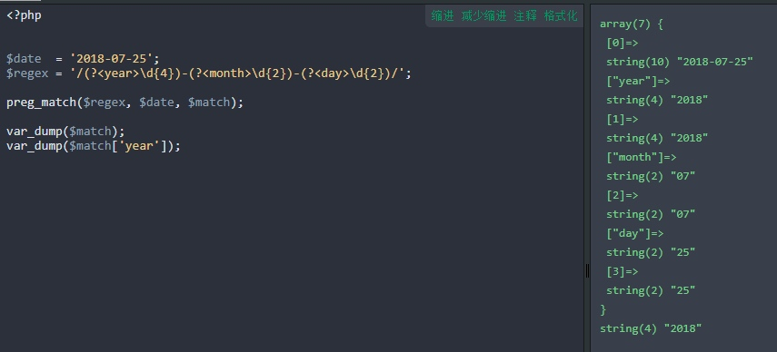


| 编号 | 命名 | 捕获子组 | 匹配内容 |
| --- | --- | --- | --- |
| 0 |  | `((?<year>\d{4})-(?<month>\d{2})-(?<day>\d{2}))` | 2018-07-25 |
| 1 | year | `(?<year>\d{4})` | 2018 |
| 2 | month | `(?<month>\d{2})` | 07 |
| 3 | day | `(?<day>\d{2})` | 25 |

- `(?<year>\d{4})-(?<date>\d{2}-(?<day>\d{2}) )`

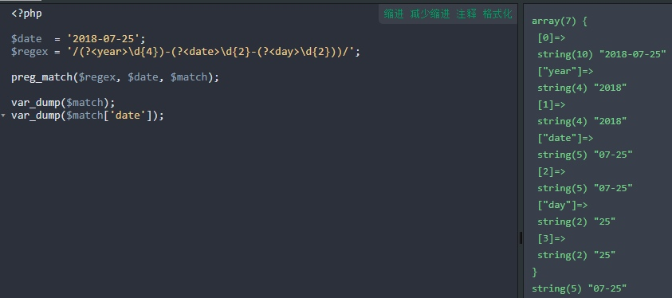


| 编号 | 命名 | 捕获子组 | 匹配内容 |
| --- | --- | --- | --- |
| 0 |  | `(?<year>\d{4})-(?<date>\d{2}-(?<day>\d{2}) )` | 2018-07-25 |
| 1 | year | `(?<year>\d{4})` | 2018 |
| 2 | date | `(?<date>\d{2}-(?<day>\d{2}) )` | 07-25 |
| 3 | day | `(?<day>\d{2}) ` | 25 |

- `(\d{4})-(?<date>\d{2}-(\d{2}) )`

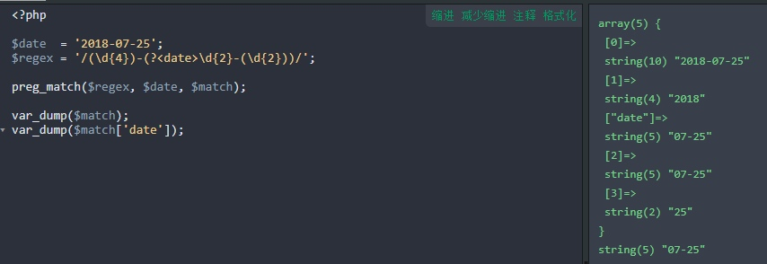


| 编号 | 命名 | 捕获子组 | 匹配内容 |
| --- | --- | --- | --- |
| 0 | | `(\d{4})-(?<date>\d{2}-(\d{2}) )` | 2018-07-25 |
| 1 |  | `(\d{4})` | 2018 |
| 2 | date | `(?<date>\d{2}-(\d{2}) )` | 07-25 |
| 3 |  | `(\d{2})` | 25 |

#### 3.3.3 使用

- 获取标签中的图片地址

`]*src="(.+?)".*>`

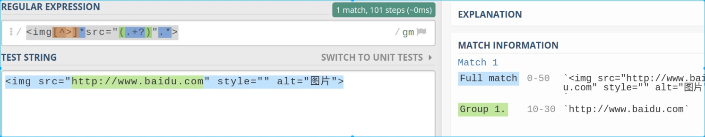


- 贪婪模式 `]*src="(.+)".*>`


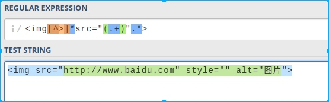

- 批量将图片地址替换为path/images目录下，并将图片扩展名修改为 jpeg

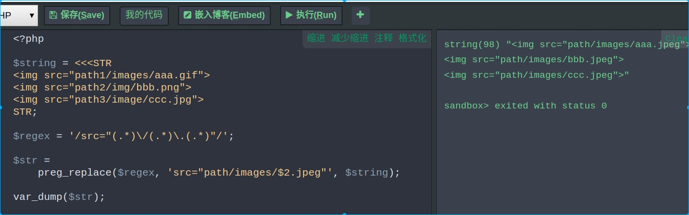

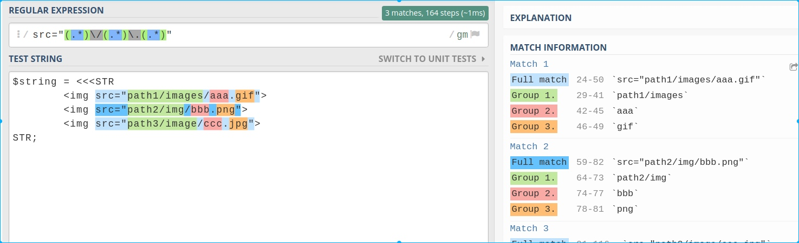

### 3.4 非捕获子组 `(?:pattern)`

- 与捕获子组相反，它不捕获文本 ，也不针对组合计进行计数

```
如： 匹配 industry 或者 industries 使用 industr(?:y|ies)写法等价于 'industry|industries'
```
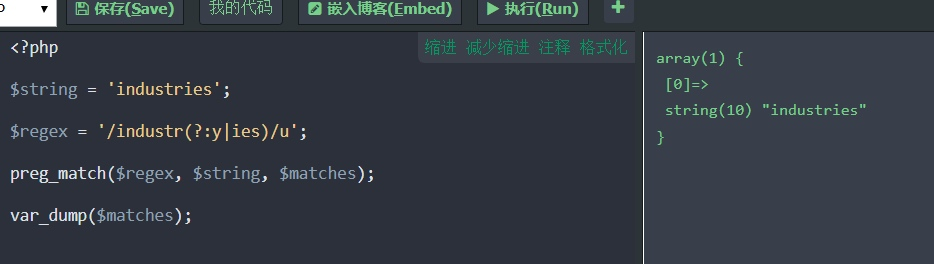


### 3.5 反向引用
常用在匹配字符串中连续出现的字符， 引用的是前面获取的子表达式。

- 引用方式

  - 使用 `\`加上数字， `\1` 引用捕获的子组中的第一个子表达式，`\2` 则是第二个 ...依次类推。

#### 3.5.1 使用

- 筛选后面连续出现的n个字符

```
$regex = '/(.)\1{n-1}/';
```

- 筛选形如 xxabc123xx的字符串

```
$regex = '/(\w)\1(.*)\1{2}/';
```
### 3.6 正向预查

- 正向预查又称正向环视，分为肯定形式和否定形式两种。查询的为后面是/不是pattern的内容。

#### 3.6.1 肯定形式 `(?=pattern)` - 后面是pattern

- `/industr(?=y|ies)/`

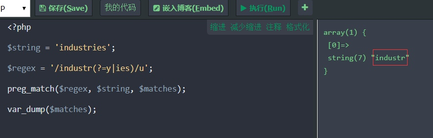


- 将 `HelloWorldHelloPhp` 字符串,按照单词分隔开.变成 `Hello World Hello Php`

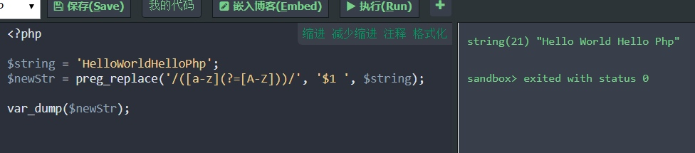


#### 3.6.2否定形式 `(?!pattern)` - 后面不是pattern

- `windows (?!\d+)` - 搜索后面不是数字的windows


### 3.7 逆向预查

- 逆向预查又称逆向环视，分为肯定形式和否定形式两种。查询的为前面是/不是pattern的内容。

### 3.7.1 肯定形式`(?<=pattern)` - 前面是pattern

- `(?<=[\x{4e00}-\x{9fa5}])\d+` - 查询前面是中文的数字串

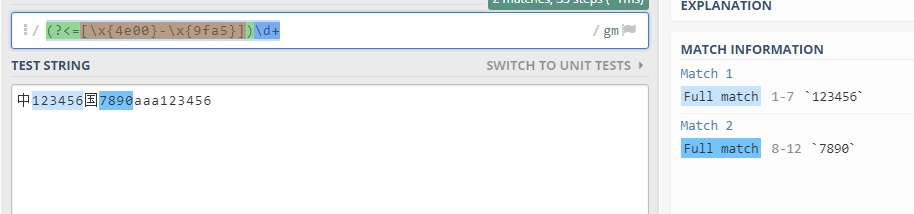


### 3.7.2 否定形式(?<!pattern) - 前面不是pattern

- `(?<!\w)\d+` - 查询前面不是字母数字下划线的数字串

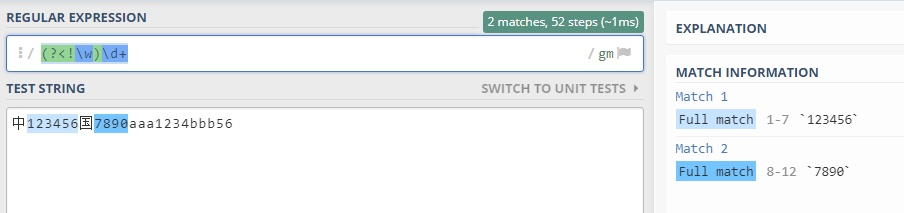


